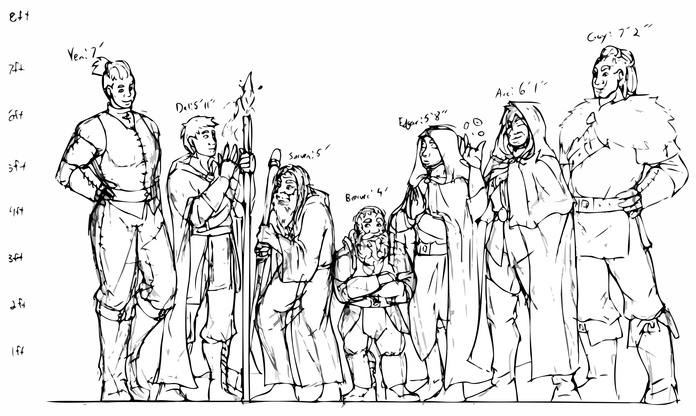

# Blackwater

These files pertain to our GURPS campaign in the Blackwater setting, run by [Matt McKaig](https://github.com/mlmckaig).

The [Blackwater IP](https://rickosborne.github.io/blackwater/) is owned by Matt McKaig.
Anyone wishing to reuse or remix it should contact him.

The characters, notes, and other materials are **not** licensed for distribution or any other use, and are the property of Rick and Corri Osborne.

The character and party art here is by [Jessica Dayley](https://www.artstation.com/jdayley).

{:.art}

<label><a href="https://www.artstation.com/jdayley">Art by Jessica Dayley</a></label>

## Sessions

{:.full-width}
| # | Date | Title | XP |
| :---: | :---: | :--- | :---: |
| 24 | <abbr title="2021-01-31">Jan 31</abbr> | [Just Walk Away](sessions/2021-01-31-just-walk-away.md) | 2 |
| 23 | <abbr title="2021-01-24">Jan 24</abbr> | [Slippery When Red](sessions/2021-01-24-slippery-when-red.md) | 2 |
| 22 | <abbr title="2021-01-17">Jan 17</abbr> | [Piece by Piece](sessions/2021-01-17-piece-by-piece.md) | 2 |
| 21 | <abbr title="2021-01-10">Jan 10</abbr> | [Gavin's No-Good Very Bad Day](sessions/2021-01-10-gavins-no-good-very-bad-day.md) | 1 |
| 20 | <abbr title="2021-01-03">Jan 3</abbr> | [Back to Blackwater](sessions/2021-01-03-back-to-blackwater.md) | - |
| 19.1 | <abbr title="2021-01-02">Jan 2</abbr> | [Meta Session: Getting Paid is Half the Fun](sessions/2021-01-02-Meta-Session-GM-Notes.md) | - |
| 19 | <abbr title="2020-06-14">Jun 14</abbr> | [She's Gone For Good, Right?](sessions/2020-06-14-shes-gone-for-good-right.md) | 10 |
| 18 | <abbr title="2020-06-07">Jun 7</abbr> | [It's Not A Fight Until Yenna Goes Negative](sessions/2020-06-07-its-not-a-fight-until-yenna-goes-negative.md) | - |
| 17 | <abbr title="2020-05-31">May 31</abbr> | [Thunderbolts and Lightning](sessions/2020-05-31-thunderbolts-and-lightning.md) | - |
| 16 | <abbr title="2020-05-24">May 24</abbr> | [One Long Breath](sessions/2020-05-24-one-long-breath.md) | 2 |
| 15 | <abbr title="2020-05-17">May 17</abbr> | [Back to the Futile](sessions/2020-05-17-back-to-the-futile.md) | 3 |
| 14 | <abbr title="2020-05-10">May 10</abbr> | [Floors and Doors](sessions/2020-05-10-floors-and-doors.md) | 3 |
| 13 | <abbr title="2020-05-03">May 3</abbr> | [Do you smell that?](sessions/2020-05-03-do-you-smell-that.md) | 7 |
| 12 | <abbr title="2020-04-26">Apr 26</abbr> | [A Dark Cloud](sessions/2020-04-26-a-dark-cloud.md) | - |
| 11 | <abbr title="2020-04-19">Apr 19</abbr> | [Guy Gets Boned and Edgar Gets Stoned](./sessions/2020-04-19-boned-and-stoned.md) | 2 |
| 10 | <abbr title="2020-04-12">Apr 12</abbr> | [Secret Passages](./sessions/2020-04-12-secret-passages.md) | 2 |
| 9 | <abbr title="2020-04-05">Apr 5</abbr> | [A Wail of a Good Time](./sessions/2020-04-05-a-wail-of-a-good-time.md) | 2 |
| 8 | <abbr title="2020-03-29">Mar 29</abbr> | [I Cast Zombie Missile](./sessions/2020-03-29-i-cast-zombie-missile.md) | 7 |
| 7 | <abbr title="2020-03-22">Mar 22</abbr> | [Slow and Unsteady](./sessions/2020-03-22-slow-and-unsteady.md) | - |
| 6 | <abbr title="2020-03-15">Mar 15</abbr> | [Poking the Undead Bear](./sessions/2020-03-15-poking-the-undead-bear.md) | - |
| 5 | <abbr title="2020-03-08">Mar 8</abbr> | [Axes Out](./sessions/2020-03-08-axes-out.md) | 3 |
| 4 | <abbr title="2020-03-01">Mar 1</abbr> | [The Undead Tide](./sessions/2020-03-01-the-undead-tide.md) | 5 |
| 3 | <abbr title="2020-02-23">Feb 23</abbr> | [Into the Sept](./sessions/2020-02-23-into-the-sept.md) | - |
| 2 | <abbr title="2020-02-16">Feb 16</abbr> | [Orcs in the Ruins](./sessions/2020-02-16-orcs-in-the-ruins.md) | 3 |
| 1 | <abbr title="2020-02-09">Feb 9</abbr> | [Gavin's Request](./sessions/2020-02-09-gavins-request-northunder.md) | 1 |

Individual session notes are available in the [`sessions`](./sessions) directory.
New sessions are automagically compiled into Word format files available in the [releases](https://github.com/rickosborne/ttrpg/releases) area.

## Reference

* [Headquarters in Blackwater](./reference/hq.md)

## Characters

* [Delwyn Brevik](characters/Delwyn-Brevik.md)

## Additional Links

* [GURPS 4e Combat Actions, Colorized](https://docs.google.com/drawings/u/0/d/1pnqf3oE2S04ZFnGJ5rc2d9WqsWGR5MyqlbzSEGotoqg/edit)
* [GURPS 4e Combat Actions, Black & White](https://docs.google.com/drawings/d/1QrNcPHtXO0Q_IlroUOFpOkRMhUKJu6gCc8zfV3TEmsI/edit)
* [Rick's Character Backgrounds](https://docs.google.com/document/d/1OeipBkEh1d2vbf5vHq0K4Q2kqwYF2oFt6QOlik1BAso/edit?usp=sharing)
