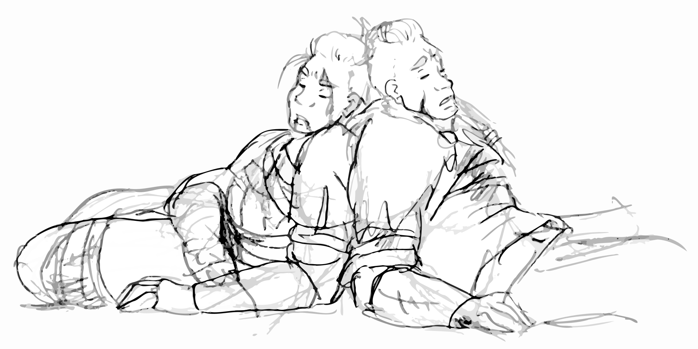

# Session 13: Do you smell that?

## The Party

Everyone was present, with no substitutions!

## Summary

The skeletal shield-bearer thrust its sword through Yenna's acid-burned leather armor.
When the blade came free it dripped with the dark crimson of viscera.
Barely noticing, Yenna feinted with one axe while driving the other down through the spine of her attacker.
The rest of its bones collapsed, shield and sword clattering on stone.

Across the room, Edgar snuck up behind the skeletal archers training their bows on Del.
His staff drove aside the bow of one, even while the second drew.
He swung a second time, knocking the skeletal arm free at the elbow.
Del seemed unconcerned with the commotion happening only steps away, freeing up his lantern hand to dig into his pockets.
The rings he'd been given by Edgar glinted in the low light as he pulled them free.

Del held up each ring in turn, first focusing on a silver ring with a large opal, then on a brass ring with an emerald.
He sighed at the opal before sliding both rings onto the tip of a gloved finger.
Shifting the lantern back to his left hand, he casually put his staff between himself and the archers.
A movement in the distance caught his eye.

The undead mage stepped out of the dark cloud, fading away like campfire smoke, to the head of the stairs.
Its hand outstretched, it hissed something and made a chopping motion.
The tornado of fire sprinted across the room toward Arc.
Caught off guard, Arc was unable to get out of its path, flames engulfing him before he was able to stride free.
Calmly patting out smoldering clothes, he flicked another stone toward the remaining shield-bearer, driving it to the ground.

Yenna, seeing the mage, paused to pick up her dropped axe and glance at Arc before sprinting to the stairs.
The mage laughed at her charge, raising its voice to taunt the interlopers.
"Flee now while you still have your lives, for when I return again I will not be so generous".
The boast gave Yenna the time to close the distance, but the mage was ready.
"Stop!" it commanded, locking eyes with the approaching Strig.
Yenna felt her muscles seize and betray her for the briefest of seconds, giving the mage a moment to step back up the stairs and into the darkness.

The remaining archer loosed its arrow, but an interposing swing from Edgar made it go wide.
Raising his staff between them, Del levitated the skeleton off the ground and spun him to face away.
The archer floated back over the ledge before Del cut the spell, dropping his quarry to the floor below.
Before it could turn around, Arc zipped another rock through its spine, finishing it.

Almost as one, the party shifted their focus to the mage.
Brorvec charged, gaining the foot of the stairs.
Arc shot off another pair of stones, each ripping holes in the mage's robes.
The effort cost him, however, sending him to the floor as his wounds caught up with him.
Del's staff froze over, gaining a familiar icy outgrowth, while Guy nocked an arrow, shouting at Yenna to shift to one side.

Frustration pouring off her, Yenna charged into the darkness.
The meaty slap of her hitting the wall could be heard throughout the chamber.
Her rage intensifying, her eyes locked on the only thing she could see from the darkness that surrounded her: Del, holding a lantern pointed directly at her, charging up a spell of some kind.
She started toward him in a flat out run.

Edgar, still invisible between them, knew he had no chance against Yenna's unstoppable force.
Instead, he focused on getting to the mage, leaping from ledge to ledge, narrowly avoiding her.
A shimmer of something caught his eye, but the mage was otherwise nowhere to be found.
He turned to yell to the group, only to see the color drain from Guy's face before the Strig crumpled.

Del, recognizing the familiar gleam in Yenna's eyes, fell back to the same trick which had worked before.
Pointing the lantern into her eyes to distract her, he poked his staff into the skeletal pile between them.
A cloud of bones that might have passably resembled an archer rose up between them.
"Oh no.  Help.  Whatever shall I do?" he said, putting more effort into the spell than into the words.

With a shout of childlike glee, Yenna's axes arced through the bones, sending splinters and dust in every direction.
Wth a tiny cough, Del dropped his staff as the archer once again fell, inert.
Yenna, panting and shaking, looked down at Del.
When he saw recognition in her eyes, he also began to shake, dropping to his knees and pushing the remaining skeleton bones away from him.
"I hate this place, these things, this ... death," he said, sliding to put his back against the wall.

Brorvec rushed to Arc, whose burns were worse than he'd let on.
Looking to Sorven and Guy, he could see the trio were breathing, but they were all going to require significant attention.
He began to unwind a roll of bandages, but Yenna approached and held out her hand to take them from him.
"Let me," she said, gingerly assessing Arc's burns.

Brorvec sniffed the air, but it wasn't out of frustration.
"Do you smell something?" he asked of no one in particular.
"Like rotting fish?"

"It's me," came the answer from Del, his voice still thin and trembling.
"Don't ask," he half-mumbled as he climbed to his feet and began rifling through the things on the workbench.

Some time later, Edgar appeared next to Yenna in a gentle puff of eucalyptus, large brass key in his hand.
She started, which shifted Arc, waking him.
"I'll be fine," he said, sitting up.
"Actually," he coughed, looking Yenna over, "you look worse than me.  Come here."
Taking the better part of the next hour, the two stabilized the injured, though there was only so much they could do for Sorven.

"I think we can use this," Del said, holding out a scroll.
"But it's not going to be easy.  This magic is well beyond my current abilities.  I will need your help."

Guiding everyone through the ritual, Del was able to focus the energies to activate the scroll.
Its ancient ink burned through all the colors of the rainbow before disappearing from the vellum.
Del collapsed to his knees even as Sorven bolted upright, sniffing the air and wrinkling his nose.
While everyone in the circle looked haggard, Sorven looked as healthy as he had when they met him.

Instead of a genial smile, he greeted the party with a squint.
"Who are you?" he demanded.
"Where have you taken me?"

The party was taken aback at Sorven's loss of memory and change in personality.
The old man was now quick to anger and take offense.
Despite the visibly ragged condition of the group, he resisted the implication that he had any obligation to heal anyone.
Edgar attempted to draw out the old man's story.

"I remember meeting a man on the road.
He spoke something that caused something in my mind to put me to sleep," Sorven huffed.
"Who woke me up after the amateur mages back-stabbed me?"

A caterwauling from the entryway interrupted the conversation.
Del, looking both sheepish and exhausted, stepped back into the room, closing the large wooden doors behind him.

"It'll quiet down in a minute," was all the explanation he'd give.
"I shouldn't have tried that when I'm this tired.
I'll never make it topside — I'm in here for the night."
Not interested in a conversation, he strode over to the desk in the southeast corner and began making a nest of books and scrolls.

Edgar and Arc, giving up on trying to change Del's mind, waited for the alarm to die down before leaving the room.
They made their way back to the central room, then up to the ruins.
The sun was just beginning to set, though it was lost behind a wall of clouds and an icy rain.
The pair did their best to gather rations and elevate the gear in their tents off the ground to keep it dry.
Rejoining the party below some time later, they passed out jerky and hard bread.

"I'll take first watch," offered Del.
"I want to take the time to do that spell right," he said, head tilting toward the entryway.
Again not looking for conversation, he took his lantern and staff and walked into the darkness.

Edgar, looking between a taciturn Del and a dismissive Sorven, moved to catch up to the former.

{:.art}

<a href="https://www.artstation.com/jdayley">Art by Jessica Dayley</a>

## Outcomes

For last week and this week, everybody gets 7 XP.
Gabriel got an extra 1 XP for good RP with Sorven.

* Del finds on the workbench:
    * Mellinarathi: Tears of the Stars (Elven Poetry)
    * Helic: The Dark Elf Wars - Korg, A Journeyman’s Guide to Barrel Making - Dr. Kromm, Raising Weasels With Confidence - Ursula Lemonde
    * Calach: A Caretaker’s Guide to Giant Centipedes - Orgoth, Enchanters Handbook - Dalamar, The Rise and Fall of the Tower of High Sorcery - Dalamar, Soul on Fire: a Treatise on The Magic of Flame - Lord Abner Ravenwood.
* Edgar and Arc find in the pile of scrolls.
    * Instant Neutralize Poison (Helic)
    * Dispel Magic (Calach)
    * Magelock (Calach)
    * Flying Carpet (Calach)
* Order of watch
    * Del - sleeping in the SE corner by the desk
    * Sorven - southeast end of the room, up against the wall on the high ledge  
    * Brorvec - also south end of the room
    * Edgar - southwest corner of the room 
    * Yenna - sleeping in the lowered center of the room
    * Guy - sleeping in the lowered center of the room
    * Arc
