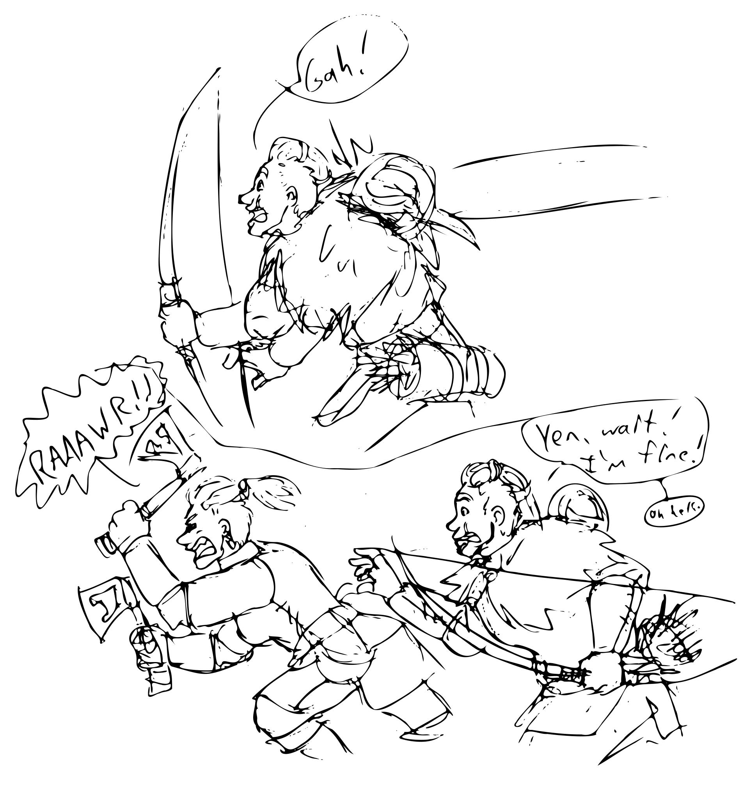

# Session 15: Back to the Futile

## The Party

Everyone was present, with no substitutions!

## Summary

The doors flew open toward the party.
A glowing purple skull floated out of the darkness, past the giant winged demon.
The party shifted for combat: Yenna drawing her axes, Guy readying his bow, Brorvec hunkering down, and Arc scanning the room for stray rocks.
Del and Sorven, both thinking of the very explosive enchantments on the doors, ran for the relative safety of the bear trap hallway, calling for the others to do the same.
Edgar raised his hand toward the skull, beginning to mutter a prayer under his breath.

Guy was the first to act against the skull, though his arrow went wide, ricocheting off the wall in the far room.
Arc was next with a pair of stones zipped into the back of the skull, both doing noticeable damage to it.

Just before Yenna was able to round the corner to the hallway, one of her chakrams tore free of its binding on her waist to fling itself at Guy's back.
Arc reached out a hand to try to stop it, but winced in pain without being able to deflect its course.
The chakram embedded itself in Guy's armor, not seeming to break his skin.
Arc groaned loudly, a trickle of blood running from his nose.

Yenna, seeing this, lost control of her temper and charged at the skull, cracking it with a blow of her axe.
Edgar and Brorvec, unsure of what to make of the scene, dropped into defensive postures.
Arc, recovering, smeared the blood from his lip before zipping another pair of stones into the back of the skull.

{:.art}

<a href="https://www.artstation.com/jdayley">Art by Jessica Dayley</a>

The skull pulsed an even brighter purple for a moment, a wave of psychic energy rippling through the hallway.
Yenna seemed to catch the brunt of the attack, dropping unconscious to the ground.
Edgar and Brorvec reeled in place, stunned.
Guy yelled for help, struggling to reload his bow.

Del looked back at the junction for the hallway, seeing Yenna's head and arm, prostrate on the floor.
Running through every spell he could think of, none would help wake his friend.
The amulet felt cold and oddly-shaped in his hand, and he wished he'd been more careful in obtaining it.
He considered teleporting to the surface, or even all the way back to Blackwater.
The thin walls of time and space here would make it almost trivial.

Which gave him an idea.

Drawing on what he knew about pinching space to draw distant points together, he tried to do the same with time.
He wasn't able to manage much, and the effort had him panting and leaning heavy on his staff, but he could feel the spell complete successfully.
When his senses returned he could hear the group arguing about going into the room, before their voices turned to surprise.
Hobbling past the sprung traps and around the corner, he gasped for air and tried to warn everyone.

"Skull.  Medallion.  Very bad.  Follow me."
Del turned and made his way back down the hall, into the larger chamber.
Turning to Sorven, Del asked politely if the other mage could spare him some energy.
Sorven agreed, touching Del's arm and transferring a portion of his arcane reserves. 
It was then that Sorven noticed Del was counting down to zero.
He was in the middle of asking what that was for when they all heard the doors slam open.

"Damn," was all Del said, looking down at the medallion in his hand, before running away from the group.

Sorven, unimpressed, wrinkled his nose.
"It's that powerful?  I've got this," he said, beginning to mutter an intricate spell that Del had never seen before.

Brorvec ran toward the glowing skull, which came floating down the hallway.
One of his armored feet crushed through a false tile, but the old trap beneath it was rusted solid.
He maintained his sprint, drawing his shield into his shoulder before barreling into the skull.
Despite the difference in sizes, the skull was unmoved by the attack — managing to dent Brorvec's shield with barely a scuff in its bone forehead.

The skull glowed the brighter purple for a second time, again pulsing out a wave of psychic energy.
The Strig collapsed in a heap next to each other.
Arc put a hand to his head, the other against the wall to steady himself.
Brorvec, the closest this time, managed to stay upright, but got a blast into the most primitive, atavistic centers of his brain, causing otherworldly images to flash before his eyes.
Unaware of his actions or surroundings, he turned and ran back into the room, gaining the stairs in seconds.

Edgar, having had a bit more time to prepare, held out his hand while speaking his prayers aloud this time.
The glow of his patron's attention became visible to those around him, especially the skull, which was driven back several yards.

Taking advantage of the distraction, Sorven was able to complete the spell he'd been muttering.
The last syllable drew out into a low, basso rumble as the form of the old man melted to the ground.
An instant later, next to Del stood a massive tiger that would have rivaled a Strig in mass and muscle.
Without missing a beat, the Sorven-tiger raced around the corner and tried to clamp down on the skull with its teeth.
But the skull managed to evade the jaws of the tiger again and again, even while Arc shot stones at it.

Another wave of psychic fear flooded the hall.
Arc collapsed to the ground, as did Sorven, who reverted to his elderly form.
Edgar, without pause, stepped forward to again drive the skull back as it tried to advance.
Del, working on two spells at once, peeked around the corner to fire an ice ball at it while also releasing an attempt to disrupt and dispel any arcane energies around the skull.
The ice managed to add a crack or two around the eye socket, but Del was unable to find purchase with the second spell.

For the second time, Del watched as a weapon ripped free from its owner and flung it at another.
This time it was one of Yenna's axes that flew into Edgar's back.
As Arc had done before, Del reached out to deflect the weapon, but was already too exhausted and unable to prevent it.
This time the axe found its way through Edgar's armor, drawing a spray of blood which shot past Del's face.

Looking around him at the bodies on the ground, Del knew he was again out of options.
Having a feel for the spell now, he reached out to pinch together the recent past, this time choosing to go a little farther back.
He paid for it, though, reeling and at the point of exhaustion as reality snapped back into place around him.

Again leaning heavily on his staff and gasping, he made his way back to the doors and the party.

"Sorven, you old hell-cat, I could use your aid," he said, approaching the old man respectfully.
He turned to face Edgar and held up the medallion, even as Sorven reached out and again shared his reserves.
"You still have the first one of these, correct?  I need to get them away from here."
Edgar looked hesitant about handing over the artifact, but did so with a trusting nod.

Del related a number of the high points of the previous attempts: a skull spirit which could take out party members with ease.
He also explained that he was going to try to teleport the medallions to the surface, in an attempt to get the skull to chase him.
The party thought it was foolhardy, but relented to the obviously harried Del.
Before he could go anywhere, the doors again slammed open to reveal the purple-ringed skull floating out of the darkness, past the winged demon in the binding circle.
The demon again bellowed to be set free.

Sorven, who had been listening attentively to Del's story, sighed and gave a shrug.
Walking into the room, he jammed his staff into the ground where the ringed pentagram carved a path into the floor.
The stone split where his staff touched, breaking both the physical and arcane representations of binding with a loud crunch heard by all and pop only heard by the mages.

The demon, with a guttural laugh, looked Sorven up and down, nodding at him before turning to lock onto the skull.
With what seemed like no effort, it reached out a long arm toward the skull and plucked it from the air.
The skull struggled to free itself, but the demon was able to drive two of its long-taloned fingers into its eye sockets, preventing its escape.
The demon's other hand smashed down on the skull repeatedly.
The bone splintered, spidering cracks in several areas but holding together.

Bones and rocks from around the room flew at the demon as the skull struggled, but none even drew the demon's attention.
With a rumble that might have been glee or frustration, the demon reached down to rip the jaw of the skull away, tossing it aside.
Another pair of blows smashed down before the skull crumpled, purple glow fading away.

The demon, turning to Sorven, said "I repay you," and pressed a finger to his forehead.
Sorven did not react to this, even as the rest of the party stared, unsure of what to make of it.
Each had been shouting at the demon about deals and opportunities for shared attacks on Lady Dunwich, but none could be sure if their words had gotten through.

Del stepped forward to the demon, which had not made any further aggressive motions.
"We have the keys," he said, holding out the Black Sun medallions, "you could help us take the fight to her."

"Her retribution will come soon enough," it said.
It turned, saying words in a language none understood and swiping at the air.
The air between its claws seemed to rip and tear, a black smoke oozing like blood to form a sickly, undulating portal.
The demon stepped through without another word, the planar tear sealing behind it.
Del went cross-eyed for a moment, mumbling some kind of incantation, but ultimately shrugged and turned back to the group and sinking against the wall.

He began retelling the full history of the fights, filling in many of the details he'd left out.
Leaving out some of the more embarrassing bits, he instead focused on the damage and treachery of the skull.
He gave special recognition to Sorven for his re-energizing, and to Arc for his repeated ability to actually hit and damage the skull.
Edgar, practically dancing with anticipation, had to wait until the end of the story to get the medallions back.

The party agreed that forewarned was fore-armed, and decided that the enchanted Ravenwood book might hold keys to the inevitable fight with the liches.
Since that would take several hours, any party members who wanted to kill time could do so in the main chamber, or even on the surface.

Del, Sorven, and Brorvec moved to the dais at the back of the pentagram room.
No one saw Edgar turn invisible, but the three saw his bodiless glow follow them into the room.
Mumbling and tracing arcane symbols in the air with his fingers, Del seemed to stare into the space between him and the book for an hour before saying one word: "Damn".

The enchantment on the book, he explained to the others, was keyed to some kind of password.
He had no way of knowing what that password was, but he was pretty sure any attempt to open or read the book without it would result in the reader catching fire and burning from the inside until dead.
It was the fire equivalent of the necromantic spell on the door locks.

Calling Arc over, Del repeated the same process against the mask while Arc, Sorven, and Edgar came up with plan after plan to get into the book.
The plans got more ridiculous with each passing minute, culminating in one so horribly bad and guaranteed to fail that the rest almost seemed sane in comparison.

"Arc," Del said some time later, "I want you to concentrate on my face.  Think about what it would feel like to look like me."
Arc raised an eyebrow, but then closed his eyes and set his jaw.

Instead of a duplicate Del, Arc's form shimmered into that of someone who might have been a minor noble or well-to-do merchant.
His late-middle-aged face had a salt and pepper goatee and temples beneath a head of dark, wavy hair.
His clothes were fine and well-made, with a travelling cape, a loose tunic, and a pair of riding pants and boots.

Edgar, studying Arc's new visage, said one word: "Ravenwood".

Professing to have an idea, Sorven asked Del for the book.
When he got it, he explained that he thought he could defeat the immolation curse.
His magic would allow him to turn a person into stone and back, leaving them as a statue long enough for the curse to burn itself out.
Del wanted no part of this, but wouldn't stop anyone from trying, and went to sit in a corner and rest.

Counting to three, Sorven began weaving his spell as Arc shifted his grip on the book.
It seemed to take some effort to get this thumb down into the pages and crack apart the covers.
He regretted it immediately, as the curse took hold and caught his very skin aflame.
Sorven, his spell not quite complete, worked quickly to finish the incantation.
In the seconds that passed, Arc continued to burn and shout, eventually dropping to the ground.

Sorven's spell took hold and everyone watched as the color and life drained from Arc's skin and armor.
A scream caught in his throat and died as an exhalation as the stone spread through him.
Guy, hearing the yells, ran over to Edgar, Sorven, and the Arc statue.
"What did you do?" he demanded.

"We should wait," was all that Sorven would say in reply, counting off the seconds in a soft mumble.

Edgar made immediately for the book, which had landed face-down.
Prodding it with his staff, he looked at Del.
Del squinted, then nodded his head.
Picking the book up gingerly, Edgar rifled through the pages.

"Huh.  Plamarise.  Why is the title in Calach?  There must be more to this."
Advancing page by page, he eventually found a section that caught his interest.
Eyes going back and forth between the book and the stone statue of Arc, he shrugged and ripped out a handful of pages before snapping the book closed and walking over to Del.
Del only had seconds to glance at the pages before Sorven distracted both men by beginning to weave his second spell.

Color and life returned to Arc, who gasped as the stone form left him.
He didn't awake immediately, but Sorven cast a third spell, this one known to all around him as his healing incantation.
Arc snapped awake, asking "Is it open?"

## Outcomes

Del gets 5 XP for a crafty way of getting the sidelined players back in the game.
Sorven gets 4 XP for being charitable and freeing the demon.
Everyone else gets 3 points.
