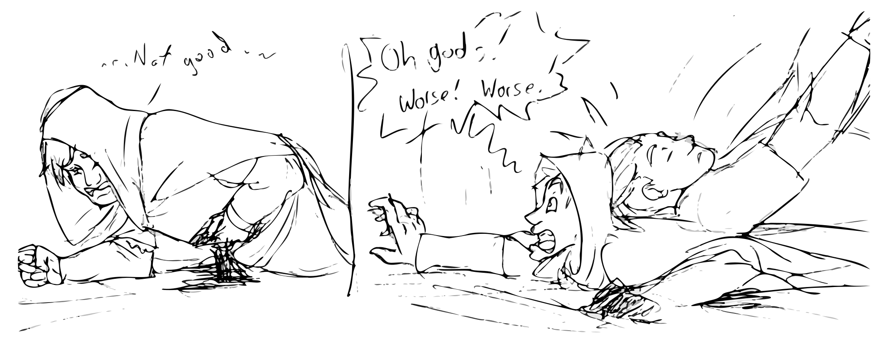

# Session 17: Thunderbolts and Lightning

## The Party

Everyone was present, with no substitutions!

## Summary

The stagnant, frigid water leeched the warmth from their skin.
Each found the rope between them hard to grip as their fingers began to numb.
Using the magic lamps glowing from their headgear, Brorvec and Yenna led the party through the underwater tunnel.
It was only a few steps to reach the far wall and opening, but the dark confines carved away the party's resolve.

Brorvec turned and pointed to Yenna and then above.
She understood, lifting him above the water and allowing him to get a grip on a ledge to pull himself the rest of the way.
The surrounding floor was flooded to Brorvec's waist, making movement difficult.
One by one, Brorvec helped the rest of the party out of the hole.

A dry, rasping voice taunted them from across the large chamber.
"Welcome, my pets.  We've been waiting for you.  I have use for you.  There's no need for violence, unless you enjoy suffering."
Lady Dunwich stood, calm and unconcerned, not a dozen strides away from them.

Guy, the last to emerge, only heard the trailing words, but they were enough.
Even as water continued to pour out from between layers of his armor, a single smooth motion found a bow in his hand, an arrow nocked, and a full draw and release.
The arrow flew true toward the center mass of the undead woman.

Lady Dunwich rolled her eyes and sighed as the missile approached, making no attempt to dodge.
Less than a hands-breadth from her chest, the arrow twisted in flight and shot back the way it came: straight for Guy.
Del, surprised but wary, pushed the end of his staff past Guy's bow.
Again mere inches from finding purchase, the arrow flipped and flew back toward the Lady.
This elicited a frown from her but nothing more, as for a third time the arrow bounced off something unseen and reversed its course.

Guy, recovering from his incredulity, dropped face-down into the water, narrowly avoiding the arrow.
Yenna did the same, the two Strig creating waves large enough to reach Brorvec's shoulders.
Edgar was not as prepared, throwing himself down too late, the arrow drilling into an invisible shoulder.

The Lady calmly swapped a potion bottle from one hand to the other before making a small gesture.
Del recognized something about the ritual, cursing under his breath.
Tapping his staff at the hole in the water he knew was Edgar, Del hissed out a warning: "She can see you!" 

Lady Dunwich hissed out another warning: "Lay down your weapons and you won't have to suffer."
The party split, sloshing through the water to make for the raised paths at the sides of the room.
With a guttural growl, the Lady raised her hands and began a complicated ritual.
Static coalesced around her, gathering into a wrist-thick bolt which shot toward Yenna and Guy.
It missed, but was close enough to boil away the streams of water running down their leather armor.

Climbing out of the water, the party faltered, unsure of how to press their attack.
Their hesitation was met with the familiar sound of stone grinding against stone, followed by loose armor rattling against exposed bone.
On each side of the room a trio of skeleton warriors stepped out of the darkness, bearing down on the party.

Sorven calmly put a hand on Arc's shoulder, chanting a quick ritual before whispering "Steel will not harm you, my friend."
Arc doesn't seem to know what this means, but nods and begins whipping stones at the skeletons.
A half dozen fly into the closest spear-wielder, tearing through armor.
It marched forward, unfazed, as the party braced for the assault.
A silvery shimmer ran along Yenna's skin as she drew her axes.

"You can serve me and survive," the Lady rasped.
Arc, concentrating, pulled an aquamarine flask out of the Lady's hand.
She howled as she lost her grip on it, grasping at the air as it sailed away.
"Fine.  I want them alive," she said as she stepped back toward a fog that obscured the rear of the room. 

Guy and Yenna attacked at the same time, axes and glaive slicing through armor and bone.
In response a pair of spears flew across the room at them.
While the Strig managed to dodge, Edgar was again not as lucky.
A heavy spear seemed to stop mid-air before a gasping Edgar appeared around it, driven to the floor.
Brorvec, the first through the tunnel but last out of the water, set his jaw at the sight before stepping in front of the Strig and readying his shield.

Yenna, with a self-control the group had not yet seen, swung one axe in a wide, distracting arc while making a quick chop to the torso of a skeleton with the other.
Brorvec followed it up with his mace to a leg, stepping forward to drive the trio of sword-bearing skeletons toward a stairway.
Blows traded back and forth, Brorvec's shield and armor an impenetrable wall.

A hiss of an unknown language came from the fog.
The swordsman skeletons paused their attack, stepping away from the group.
The third spear flew across the room at Yenna, who was able to dodge only by falling on her stomach.
Brorvec and Guy braced for what should have been an attack, but it never came.
The skeletons stepped forward and re-engaged, swords again failing to make it through Brorvec's armor.

The spear-throwers each drew their own swords, focusing on Arc and Sorven.
Arc zipped more stones into them as he and Sorven raced along the dry floor to regroup with the others.
The skeletons matched their speed, soon flanking the party on the narrow walkway.
Sorven, now seeing Edgar's condition, looked to Yenna and said "I'll need you to pull that out."
Arc, face pail and strained from his efforts, made a snap decision and dove back down into the hole, swimming back they way they'd come.

{:.art}

<label><a href="https://www.artstation.com/jdayley">Art by Jessica Dayley</a></label>

In the chaos, none noticed that Del was no longer standing behind them.
No one saw him vanish only to reappear at the far end of the room, barely visible past the fog cloud.
He stood at a long workbench covered in arcane paraphernalia: books, scrolls, ink, ritual bowls, skulls, and uncountable odds and ends.
Grabbing the first thing he saw, he shoved a set of keys into his pockets, squinting and concentrating on each other item in turn.
Objects, one after another, stood out to him: a magical spyglass, a large book, some kind of a rod with a large red orb, a silver dagger, and a pair of bracers.

Lost in his search, he didn't see the ball of swirling grey energy fly out of the mist until it was too late.
He twisted and grabbed for it, as if to pluck it from the air, but instead took the full force of its impact as it hit his chest.
A thunderclap blew him back several yards, tearing at his flesh and sending the detritus on the table in every direction.
Del remained standing but only just.
Bleeding from eyes, nose, and ears, the mage struggled to regain his bearings.

A lightning bolt tore from the mist.
Del shimmered and reappeared steps away, hair now smoking and singed.
He stumbled, unbalanced and unable to recover.
Trying to concentrate and resume his search, blood welled in his eyes, blocking his vision.
Frustrated, he stepped forward toward the mist and began a long incantation which drew enough magic from the air to cause it to shimmer and boil around him.

The melee continued on the other side of the room.
Six sword-wielding skeletons continued to slice and stab at the party, slowly pushing everyone back-to-back.
Another rasping hiss came from the mist.
Yenna, Guy, and Edgar dropped where they were, instantly falling asleep, with only Brorvec and Sorven managed to stay awake.

Sorven immediately chanted a spell to awaken them, but he stumbled on the words that were only half-remembered, causing the spell to fizzle out.
He tried a second time with similar results before delivering a frustrated kick to Yenna's ribs.
This had the effect the spell did not, and she groggily worked back to her feet.
Through all this, Sorven managed to parry sword blows with a surety that belied his ancient frame.

Brorvec, enraged, managed to strike one of the skeletons hard enough to cause it to drop its sword.
The other two continued to swing for his legs but never found flesh.
Harried by attacks from three sides, Brorvec's own swings also had trouble hitting their targets.
Driving a heel into Guy's chest, he called "Get up, you lazy git!" before landing a blow which drove a skeleton to the floor.

A roaring ululation let everyone know that the time for Yenna's restraint was past.
She leaped at the skeletons in front of Sorven, swinging wildly.
Not bothering to feint, the skeleton shields found each telegraphed swing and drove them aside.
The few blows which did connect carved away at armor and bone, but did not stop the attackers.

Guy gained his feet, and readied his glaive.
But he struggled to shrug off the hypnosis, the glaive wobbling in its path and finding nothing but air.
A second swing managed to connect with one skeleton, knocking it into the water where it lay, still.

Sorven, staff unable to keep up with the swords coming at him, took a hit to one leg and fell to one knee.
He growled in pain, but the growl drew on and deepened to a basso rumble which reverberated between the stone walls, setting up a standing wave which went unnoticed in the water.
His robe and staff falling to the ground, his limbs lengthened and sprouted orange and black fur.
Seconds later, Lamikel the Striped stood in his place — a tiger even larger than the Strig behind it.
It roared and struck at the skeletons, snapping with teeth and slashing with claws.
Despite a still-bleeding hind leg, Lamikel was more than agile enough to avoid the incoming swords until one finally got through and left a large gash across one foreleg.

The effort of the ritual caused sweat to run down Del's face to mingle with the still-dripping blood.
Second after second ticked by as he gathered more and more energy.
But something was wrong — the rattling he'd taken seemed to wear off, but instead of strengthening his resolve the clarity seemed to bring only despair.
He closed his eyes for a long moment before dropping the effort, letting the magic flow back out of him.
As he opened them a ball of orange light caught his attention: the familiar sight of a forming fire tornado.

The ball stretched into an inverted cone almost as tall as he.
It was mere yards away — barely beyond the reach of his staff.
Del stared at it, taking one last glance at the workbench.
He knew he wouldn't have enough time to continue his search before the flame enveloped him, and he was barely conscious as it was.
Slicing at the air with his staff, he opened a portal to darkness and stepped through. 

His foot landed on another stone floor, but something didn't feel right.
It dropped away beneath his feet, faster than his addled senses could track.
The second it took for him to realize what was happening was more than he had.
His legs bucked as they slammed into cold water, even as he'd already started the incantations he'd only just worked out since coming to this place.
Miraculously, he managed to not black out from the pain, finishing his spell and rising back above the frigid water.
But his blood rushed in his hears and he knew it was a matter of seconds before he blacked out.

Brorvec saw the ball of grey energy shoot out from the mist.
Arcing through the air where he'd stood only moments before, it exploded almost in the middle of the remaining skeletons.
The concussive blast was loud, but the more heavily armored party weathered the blast better than Del.
Guy was caught off guard, stunned, but the boom managed to wake Edgar.
Without missing a beat, he began to pray, calling upon his deity for aid.

## Outcomes

Del spent 9 XP to reroll at various times.
Brorvec spent 1 point the same way.
