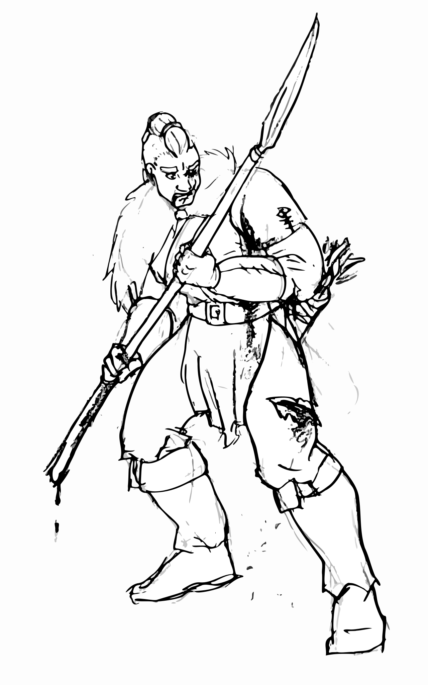

# Session 18: It's not a fight until Yenna goes negative

## The Party

Everyone was present, with no substitutions!

## Summary

Alone and floating in the dark, Del struggled to stay conscious.
Concentrating, he attempted to repeat the spell which had failed and brought him here.
When he opened his eyes again he was standing next to the skull capstone, magic and life continuing to drain out of him.
He sank to the floor, propping himself up against the stone wheel, doing his best to stay calm, still, and awake.

Guy looks unsure as he reaches down and pulls the spear out of Edgar's abdomen.
Edgar cries out and bright red blood seeps from the gash.
Lamikel, at the ready, reaches down with a large paw and releases a healing spell to close the wound.
Edgar's eyes go wide before he rolls over to get to a knee, vanishing.

Beside him, an enraged Yenna feints and attacks one of the skeletal sword-bearers.
The swing lands, but the skeleton looks unfazed.
It counters with a swing to her right leg, which sinks deep into the meat of her thigh.
A second skeleton also swings for her legs, but Edgar is able to parry the attack well enough to knock the sword out of its grip and into the water.
Axes whirling, she alternated between feints and blows, landing several even though many were blocked.

Brorvec pushing his advantage against the skeletons to give them some space, yelled over his shoulder, "It's safe to fall back!"
A crackling from the cloud drew his attention, followed by a streak of lightning.
Dropping to the ground, the lightning missed him and dissipated against the stone wall beyond.
He was ready for it, and was back on his feet in one fluid motion.

Ignoring the skeletons advancing toward him, Lamikel bounded past them along the walkway.
His ears perked and twitched, seeming to react to things in the mist no one else could hear.
Dodging past the fire tornado, his focus on the fog allowed a skeleton to stab him in the hindquarters.
Head down, he pounced into the mist.
The psychic assault was immediate, but his tiger senses were up to the task of stalking unseen prey.

Leaping, pouncing, and batting at the mist, Lamikel methodically worked around the area.
He never managed to connect with any foes, only frustrating him further.
It seemed that no matter how hard he concentrated, he couldn't pick out the movements of the necromancers from the surrounding din.
Lightning streaked toward him, but its sizzling crackle gave him plenty of warning.

By the stone stairs, Guy continued to press his attack against the skeletal swordsman.
Flicking his head toward Yenna, he said to Brorvec, "I've got this one."
The skeleton reacted to this, beckoning Guy with his sword.
Guy, focused, didn't notice the fire tornado coming toward him.
He did manage to skewer the skeleton, but then watched as it pulled itself off his blade before lunging once again.

The cone of flame rolled over Guy, surprising him.
He was able to take one large Strig-sized step away, but it didn't get him out of the heat.
His exposed skin along his neck and arms blackened and charred.
Gaining momentum, he was able to get farther away and swing around to keep an eye on it.

{:.art.max-width-half}

<a href="https://www.artstation.com/jdayley">Art by Jessica Dayley</a>

Weighing his options, Guy charged into the mist.
Its disorienting effects tore at his mind, but he was able to keep his composure.
He brought up his glaive to swing in a wide, shoulder-height arc.
He felt the familiar bite as the blade sunk into flesh, followed by a throaty feline yelp.
Moments later Lamikel sailed out of the mist and sunk his teeth into Guy's shoulder before regaining his composer and disappearing again.

Yenna faced off against the pair of skeletons, one of which jumped into the water after its fallen sword.
She continued to feint, attack, and repeat, but the armor and shields of the skeletons made for slow progress.
Edgar, invisible next to her, jumped to his feet and circled around behind the other skeleton.
Swinging twice, he couldn't get a good angle as his staves glanced off the skeleton's armor.
He was, however, able to parry several more sword attacks aimed at Yenna's legs, and with a final crushing blow dropped the first skeleton.

The second skeleton rose from the water with its recovered sword, headed straight for Yenna.
She and Edgar landed several blows, but the skeletal knight stayed up.
Frustrated, Edgar pressed too hard and fumbled an attack.
One of his staves goes flying off into the water, becoming visible as it left his hand.
Brorvec dropped into the water next to the skeleton and joined in the assault.

Only steps away, Arc rose up out of the water, floating above it.
Surveying the room, Arc reached out a hand toward the languid mist.
His body trembled with the effort, but a heartbeat later the fog began to move aside.
He could feel something resisting him, trying to drag the cloud back to the center of the room.
It took everything he had, but he was able to reveal the pair of necromancers.

Ravenwood swept a glowing scepter in a curve across the room.
The cone of fire followed his command, leaping toward Yenna.
The magic fire fought against the silvery glow of her own protective spell, setting off small harmless sparks up and down her armor and skin.
Yenna continued to swing wildly at the skeleton, ignoring the danger.
The fire tracked her as she circled, eventually moving away to try to catch Edgar and Brorvec.
Brorvec managed to dive aside, but the smell of burning eucalyptus flooded the area as Edgar's exposed skin reddened and cracked.
Edgar dove for his lost staff, using the opportunity to cool his singed flesh in the dank water.
He came back up in time to block a sword heading for Arc, throwing it off just enough to miss his new friend.

Yenna, seeing her opportunity, buried both her axes in the spine of the skeleton, dropping him into the water.
The rage cleared from her eyes as she looked for her next target.
Fire tornado tracking her every move, she dove into the shallow water, getting just enough of her sizable form beneath it to avoid the flames.
Pushing herself along the floor, she stayed down long enough to lose Ravenwood's interest, only surfacing after the fire veered off.

Brorvec, realizing he was in the water instead of on top of it, had a flash of insight.
"Something's wrong with Del!" he yelled, though without opportunity to do anything about it.
Instead, climbing out of the water and past the flame, he ran to mount the stairs.
A lightning bolt struck him, crackling across his armor, but he pressed on.
Half-way up he felt the briefest tingle before popping out of existence.
When he reappeared he found himself in a small chamber with no visible doors, only a grate several yards above his head through which he could hear the fight continuing.

Mist pulled aside, Lamikel finally saw why his effort had been unsuccessful: Lady Dunwich floated yards from the ground, casting spells with impunity.
Growling, he leapt at her, snapping his jaws.
Where her head was only moments before he found nothing but air as the Lady rematerialized a short distance away.
A second leap and snap which again found only air.
A third leap found the flesh of her hip, though he wasn't able to keep a grip on her for long.
She countered with a lightning bolt, catching him off guard, but he kept coming.
Another leap again finding shimmering air, his attention shifted to the nearby Ravenwood.

Guy, taking one final swing at the skeleton in front of him before moving toward Lady Dunwich.
She was at the farthest reach of his glaive, but a skillful strike found its mark.
What would have been a mortal blow instead passed through her, the steel blade finding no flesh.
Distracted and cursing, Guy again did not notice the column of fire approaching him from behind.
For a second time more of his skin began to blacken and char, as did the hair sticking out from under his new helm.
A sword followed the fire, striking at his back and digging deep into the leather, nicking the skin beneath.
He managed to get out of the fire, but not without significant effort.

Edgar, seeing the fire take its toll, remembered the little glass vial of red liquid the mages thought might resist its effects.
They'd last seen it in Arc's bag, now slung across the man floating just a few steps away.
Splashing his way over, he whispered "I'm grabbing the potion" to Arc, who nodded but made no other move.
His hand found two vials in the bag, one of which was a glowing scarlet.
Dropping the other back in the bag, he made his way over to dry ground.
"Hey, Yenna" he called, "drink up!"

The Strig woman looked over, but took a moment to understand why a glass vial was floating mid-air several yards away.
Grabbing the potion, she made her way back through the water toward the rest of the party.
She got in striking range of the mage, though he evaded her attacks.
Behind her, Edgar's second staff popped into visibility as he lost control of it and it went clattering to the floor.
He recovered it, the pair of floating staves heading toward the fight.

Lamikel, dodging to stay out of the fire, moved to attack its source: Ravenwood.
As if coordinated, the mist and fire converged on Lamikel to slow his progress.
Uncaring, the tiger went straight for the mage's skull.
Large teeth piercing bone, the feline kept its hold and began to shake and claw at the grappled skeleton.
The power of his jaws sent a spiderweb of cracks through the bone.

Guy, frustrated at his inability to damage Lady Dunwich, moved out of the water.
He heard what he thought was Brorvec, a quick stream of words coming from atop the stone stairs to the north.
Mounting the ledge, he found a large grate with a robust padlock.
Beneath it he saw the glow of Brorvec's helm, the Dwarf staring up at him.
What should have been a warm or grateful greeting was instead a warning: "Behind you, fire!"
For a third time the column of fire bore down on him. 

A pair of magic frissons ran through Lamikel.
He recognized the first immediately: the necromantic energies attempting to rot him away from the inside.
The second slid off him, unrecognizable and ineffective.
The distraction was enough — a sword dug deep into his side, slicing open a gash through which several ribs could be seen.
Ignoring the pain, he again clamped down and was rewarded: the mist and fire winking away around him.

Yenna, seeing this, loosed her battle cry for a second time.
Dropping the flask now forgotten in her hand, she pulled her second axe and swung both at the mage.
Trapped in the tiger's jaws, the mage could not evade and took both hits to the spine, dropping its lower half into the water.
A brief flicker of restraint passed across her face before she pushed it away, rage and focus shifting to the remaining sword knight.

Lady Dunwich, emotionless, rasped out a bored sigh.
"I never did mind about the little things."

Lamikel turned to again focus on Lady Dunwich.
Biting at her, she again shimmered and vanished from his reach, countering with a bolt of lightning.
The skeleton behind him again landed a gash across his ribs, but Lamikel only roared and doubled his resolve.
Guy moved to try to peel away the attacker, but his glaive glanced off the skeleton knight's armor.
Yenna and Edgar also converged on the skeleton, fighting the water to get to their friend.

Arc, racing up the far side of the room, felt a shiver of magic along his skin.
Before he knew what was happening, he was several yards from where he'd been, now entrapped in a metal cage.
Regaining his bearings from his hanging cage, he reached out a hand and his mind to grab at the swordsman's weapon.
He managed to get a grip, but couldn't wrench it away.

## Outcomes

Quote of the day goes to Matt with: "It's not a fight until Yenna goes negative."

A few players spent XP for some clutch rerolls:

* Arc spent 1 XP to reroll for his TK Grab on the mist, then a second on a Will roll.
* Jessica spent 1 XP to reroll her hit against Lady Dunwich.
* Gabriel spent 1 XP to reroll against the mage.
