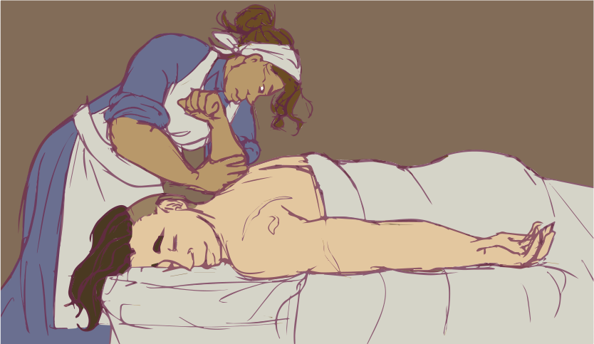
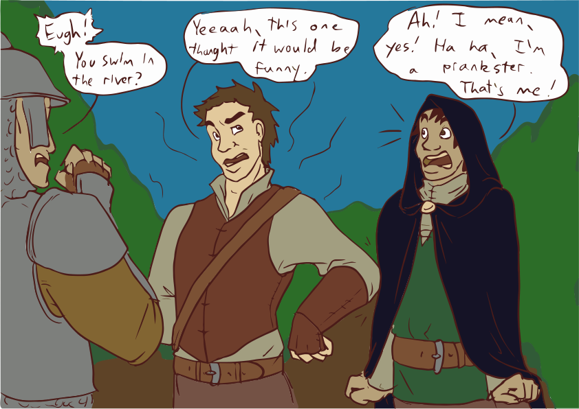

# Session 20: Back to Blackwater

## The Party

Everyone was present.

## Summary

In the morning, Del and Edgar decided to head into Blackwater to get some shopping done, but to also get a sense of the security at the main gate.
Stripping down to street clothes, Del offered to take Yenna's acid-burned leather chest piece to the leatherworkers at the Mad Cow.
He also improvised a magical concealment charm in an attempt to hide any traces of magic from his staff and the new water-magic powerstone.
He seemed unhappy with the result, but it was good enough for the time.
It had the unpleasant side effect of making him reek of dead fish, though for some reason this seemed to suit his purposes.

Arc, happy to be back in the land of civilized entertainments, obtained his daily stipend from Guy and vanished toward the seedier end of town.
Guy and Yenna, with nothing interesting to do in the city before getting paid, opted instead to treat themselves, along with Sorven, to baths and massages as luxurious as the Ferton Inn could manage.
Guy was quite happy to divvy up the found coin to the party to give everyone some spending cash.

{:.art}

<a href="https://www.artstation.com/jdayley">Art by Jessica Dayley</a>

Edgar hemmed and hawed about whether he would sneak into the city or just walk in like normal.
Upon hearing how Del was going to try to be seen as doing everything above board, Edgar agreed.
He did, however, maintain his practice of keeping his leather armor equipped and hidden beneath his clothes.

Arriving at the gate, Del asked one of the guards for a bag for the leather armor.
The guard, seeing their brass residency tags, waved them through with only a questioning word about the mellifluous odor coming off Del: "have you been swimming in the river?".
Hooking a thumb at Edgar, Del rolled his eyes: "this one thought it would be funny to throw me in".
Splitting up after entry, Del headed straight home to stash away his staff and powerstone.

{:.art}

<a href="https://www.artstation.com/jdayley">Art by Jessica Dayley</a>

Edgar, visiting his contact Nelora, learned that drider leather was quite prized and valuable.
In turn, she'd recently come into possession of a ring which would grant the wearer increased agility for a short time.
At $30,000, however, the price was beyond anyone's means at the moment.
He then found his way to see Rosamonde Ohrenstiel at the Hammer & Sword Smithy.
After some negotiation, he was able to order a set of fine thieves' mail which would be complete in a fortnight, for just $1300 with half down up front.

Del, now at the Mad Cow Leatherworks, was able to arrange for Yenna's armor to be repaired for $75, which would take the next 3 days.
He enquired about the establishment's experience working with drider leather.
The artisans scoffed, expressing disbelief at the existence of such a beast, until Del presented them with a small square he'd brought with him.
Excited, the crafters reasoned the leather would likely hold up better to sharp, edged weapons than their usual medium leather.

Edgar showed up around this time, and the two walked back to the inn for lunch.
While there, they sized up the bolt of leather and discussed with thr group who would have new armor made from it.
Yenna insisted that Del upgrade his armor, foregoing her own desire for upgrades, and get something for his legs, arms, and torso.
Edgar stuck with his legs and arms, while Guy was quite excited to be able to get a set of leather pants in his size.

Lugging the bulky leather back through the gate, Edgar and Del made their way back to the Mad Cow.
Del negotiated with the workers, noticing they were quite happy to keep the remainder of the leather, several square yards, as payment for the job.
Instead, Del opted to pay them the $200 they asked, plus a $50 tip for their time and effort with the new material.
The work would take them about a week to finish.

Later that night, Gavin and his posse showed up.
The men with him were heavily armed, no-nonsense types, two of who were carrying a large and heavy chest.
Before getting down to their primary business, the party presented Gavin with one of the books they'd found: _The Life of Dragons_ by Gerin Monkrief.
Gavin was quite surprised to see it:

> This is my daughter's book!
> She only wrote it a few years ago, and only had a few dozen copies made.
> I'm surprised to see it in their possession.

He seemed mildly disturbed, while the party had expected him to be delighted.
His mood continued to darken, as he found the haul to be somewhat lackluster, though he remained professional.
There was something of a sparring match between Edgar and Gavin about the ultimate buyer for the Tome of Asturias, Del concerned that anyone with an interest in such a book was likely quite dangerous, though the party eventually backed down and handed the book over along with the rest.

To everyone's surprise, as Gavin had the chest with payment brought into the room, he also presented a second offer:

> You could take these 400 Talents as we agreed.  You've earned it.
> But you've also proven you can handle yourselves.
> I'm in a position to hear about similar opportunities as they arise.
> This money would also cover a year's rent in the top two floors of my building.
> How about coming to work with me?
> I think with your skills and my contacts, we could do quite well for all of us.

The party, wanting to talk it over, told Gavin they'd meet him at his building the next day around lunch.
Instead of taking the payment for the job, they took 340 silver Talents ($8500), the appraised value of the rest of the haul.
The remainder would be worked out the following day.
Guy, wanting to get more information, toured several inns and taverns, meeting people and carousing.

## Outcomes

* From the coin found at the sept ($9200) and the reimbursement from Gavin ($8500), everyone got $2525 and some loose change.
* Del put $150 toward the fees at the Mad Cow, while Edgar put in the other $100.
* Yenna covered the $75 for her armor repair.
* Edgar spent $1300 (half up front) for his new chest piece.
