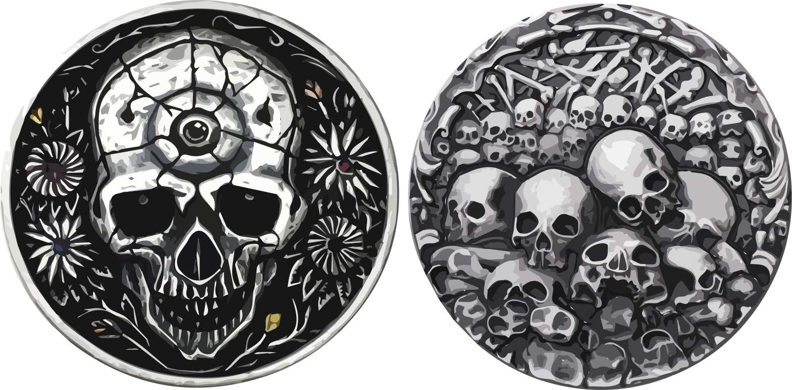

# Session 22: Piece By Piece

Day faded into evening, with the thunderstorms showing no sign of letting up.
Gavin, the staff, and the party stood around the merchant's desk, working through the details of the preceding days.
Del, ever focused on time and causality, pressed Gavin for what he saw as a hole in the story:

> How can you claim no knowledge of the Lady?
> It's not like we showed up in that sept singing your name.
> Why did she come to you first, and not us?
> Clearly, she already knew who you were before we even got there.

Gavin denied the possibility, sticking to his tale of ignorance.
He stammered something about the intervening week it took to get back to Ferton and then Blackwater, during which time the Lady could have learned all she needed.
Sorven undertoned something about scrying magics, which garnered a nod from Vaelyn, though Del remained unconvinced.

Del changed tack, asking about other adventuring and acquisition teams in town, or about other merchants and entrepreneurs who might view Gavin as competition to be eliminated.
Gavin explained that's why he'd been so excited to work with the party: skilled delvers were few and far between.
Sorven, in an attempt to calm both men, took over the conversation and told Gavin more of the encounter with the Lady.
In a huff, Del walked off to search Gerin's room.

Once the conversation began to circle, the group rattled off their options:

* Try to use the magic on the chest key to locate the chest itself.
* Find more items and reflective surfaces through which to view history.
* Head out in the rain, or wait until morning, to find the hills from Vaelyn's vision of Gerin.

Vaelyn, still winded from her earlier efforts, struggled to bring the magic together to get a sense for who else might have been in Gerin's room.
Her cast fizzled, and Sorven pulled her aside to once again re-vitalize her.
She was about to try again when a commotion below caught everyone's attention.

## The Messenger

A pair of raised voices drifted up the stairs — one older and deeper, the other younger and higher.
Arriving in the entrance area, the party found Larence, the stable hand, holding a pre-teen boy by the arm, keeping him out of reach while the boy attempted to swing at him and struggled to break free.
Del, the first into the room, asked what was going on, but got only a shifty glance in reply from the man.
Gavin, following shortly behind, prompted an explanation:

> He was trying to leave, but with all the goings-on, I thought you should talk to him.

The hand explained that the boy brought some items, ostensibly just a small delivery like any other, but something about the boy's demeanor seemed off.
Fave, quietly sneaking up behind the pair, plucked a small wooden box and a note from the boy's hand.
Looking inside, he quickly snapped the lid closed again, looking around the room.
Sorven, seeming to know what was in the box already, took the note and read it aloud:

{:.art.max-width-half}

Gavin, demanding to know what's in the box, was shown the gruesome contents: a severed finger.
Eyes turned to the young boy, yelling and demanding to know more about who'd sent him.
Guy and Yenna had to step in to prevent others from coming to blows with the child.
The boy stammered out an explanation:

> Some fat guy.  Big, blonde hair, green eyes.
> He gave me a loaf of bread and asked me to run a small errand.
> I was just hungry!
> I didn't know what was in the box, I swear!

Fave took the second item from the box and passed it around: a large silver coin with skulls stamped into it.

{:.art.max-width-half}

Vaelyn, seeing the coin, shrank back from the crowd, drawing her daughter close.
She told the others to be wary of traps placed on the items by magic users, who could be scrying on them at this very moment.

With a disconcertingly gentle puff of eucalyptus, Edgar shimmered into view as he picked up the messenger by the shirt and pressed him against a wall.
He yelled into the boy's face, demanding to know why he'd been watching them earlier.
The boy, nearly in tears, stammered out a reply:

> They just told me to keep an eye on you!

Guy, pushing Edgar back, lowered the boy to the floor, interposing himself between the two.

## Thoughts Exposed

Vaelyn gathered Del, Sorven, and Rayna to the far side of the room, muttering an incantation as they walked.
She glanced over her shoulder to lock eyes with the boy for a brief instant, before looking back to the mages.
Her eyes had gone cataract-white, the skin around her temples flushing and throbbing with the exertion.
Speaking slowly, as if trying to be heard across a great distance, she whispered to the huddled men:

> His master's name is Ed the Red.
> I believe he's the one I saw writing the first note, in some tavern.
> The boy doesn't know who the man works for, but he's worked for him as long as the boy can remember.
> The man can usually be found around the docks, or at the White Mallard.
> The boy saw Gerin earlier, but I can't—

Vaelyn sunk to the ground, panting, her eyes returning to normal.
Sorven, his hand on her shoulder, also seemed flush from the effort — he'd sensed her intent and had lent her what he could.
Del, seeing the two weren't going to try any more magic without some rest, walked back over to Edgar and whispered what they'd learned.

Edgar, getting as close to the boy as Guy would allow, demanded he tell them everything he knew about this Ed the Red.
The boy, caught off guard at the mention of the name but recovering quickly, said he didn't know anyone named Ed, only Louie.
His story changed several times, gaining confidence Edgar wasn't going to be allowed to actually hurt him.

Having acquired some local leads, the party split into three groups.
Edgar, Fave, and Del would check out the White Mallard.
Yenna and Sorven would head to the docks.
Arc, Brorvec, Gavin, Guy, and Vaelyn and Rayna would stay at the Skeleton Key.

## Back Into the Storm

Yenna and Sorven made their way along the waterfront, huddled beneath their cloaks against the driving rain.
They saw only a few people unlucky enough to also need to be in the rain, and none matching the description given by Vaelyn.
Finding themselves alone in Ropemaker Square, after huddling against the wall for a brief moment out of the rain, they turned around and made their way back to Salt Way and on toward the Father's Sept.

Fave, Edgar, and Del, meanwhile, approached the White Mallard.
Del peeled off from the trio, heading across the street to lean against the building along Barge St.
Edgar glanced around, before shimmering and disappearing into the rain, leaving an odd effect where the rain seemed to flatten against a hole in the air.

Fave, seemingly alone, stepped through the door of the Public House.
Had he glanced over his shoulder, he would have seen Del give a similar look around before doing something with his hands that seemed to draw the stone wall tight around him, obscuring him from all but the most determined of observers.
He elbowed Edgar in the ribs before brushing water off his own shoulder, indicating the other should do the same.
A spray of water which had seemed to hang in the air dropped to the ground, though no one seemed to notice. 

The tavern had maybe a hundred people inside at dozens of tables of all shapes and sizes.
The room seemed to be in constant motion, with people standing up, walking around, and generally trying to enjoy their dinner on such a dismal night.
Fave, pulling a scrap of paper and a piece of charcoal from his pockets, walked up to the bar and began to scribble a note, asking if the place rented rooms.
The man behind the counter allowed that they did, and they had a nice room in the basement available now if needed.
Fave asked about rooms upstairs, but the man maintained the only available space was in the basement.

Fave pointed to a mug and a pitcher of mead, patting down his pockets for coins.
A pocket which had been empty moments before found itself a few silver Talents heavier thanks to some quick action by Edgar.
Fave slipped one across the bar at the man, indicating he had more questions.
The bartender liked where this was going, nodding his assent.

Fave was able to get confirmation that the man they were looking for, Ed the Red, was known here.
He'd last been seen some half hour before.
The bartender said the same thing gained from the boy: Ed could usually be found between this tavern and the docks.
Further questions ran through the supply of silver Talents, but didn't gain Fave much more than he already knew.

Thanking the man, Fave knocked back his mead and left the tavern.
Turning as if to head toward Main St, he only made it a step before a quick punch to the shoulder from Edgar spun him to head toward the Father's Sept instead.
Not seeing Del, they made their way slowly up the street.

Del, maintaining not just the illusion of the wall, but now also a second spell to keep the rain and runoff away from him, sank to his haunches and began to count off the seconds.
He'd just hit sixty, and had begun to question whether standing in the rain was worth it, when the door of the tavern opened.
A middle-aged human man, jowly, with a brownish beard and a receding hair line, popped his head out, looked around, and went back inside.
Del restarted his count, this time resolved to wait five minutes just to be sure.

Up the street, now too far to be seen through the rain, Fave waved at the sight of a familiar Strig and staff-leaning old man approaching.

## Outcomes

* 2 XP for most, 1 extra for Vaelyn and Guy
