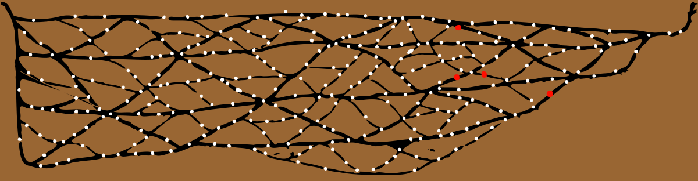

# Session 24: Just Walk Away

In the Skeleton Key, Guy and Vaelyn talked through whether to head out into the rain to catch up with the others.
Brorvec offered to stay and watch the street kid, continuing to armor up.
Vaelyn concentrated for a moment, reaching out with her mind to connect her thought's to Del's.
Del replayed the encounter with Red and the butcher, advising them to stay put.
This frustrated everyone, but the rising tolls of the Watch alarm bells reinforced the decision.

In Gladstone Alley, Fave ran up to the butcher and planted a slow heel kick into the ribs of the much larger man.
Knives flashed out in an awkward parry, but the young monk avoided the blades.
The man was unhurt, but driven back several yards from the alarm bell.
Fave grabbed the chain dangling from the clapper and began to ring it himself.
Confused, the bald man just looked at the youth.

Edgar walked over to Red and began to speak last rites, kneeling to close the boy's eyes.
A quick search of the body revealed a small leather strip with some markings, but not much else.
Glancing over his shoulder to see that Fave was keeping the attention of the butcher and beggar, Edgar faded into invisibility.

Del walked over to Sorven and Yenna, beckoning them into a close huddle:

> Do we want to be here when the Watch arrives?
> This is the Old Town.
> The guards are more likely to trust a local butcher than two staff-wielding passers-by and a Strig.

Agreed, the three made their way to the north end of the alley.
As they turned east onto Gold Row, Yenna felt a tap below her shoulder blade from an invisible Edgar.
Reaching Master's Road, they silently agreed to split up, with Yenna and Edgar heading north to the river.

## Weird Flex, But Okay

Turning onto Blackwater Avenue, Yenna again felt a tug from an invisible Edgar.
Pressed into her hand, a small strip of leather appeared.
She moved to a building to benefit from a torch, looking closely at the item.

Kneeling a bit to tighten the laces of her boots, she whispered: "what do you want to do?"
Edgar said he wanted to look around, using the spyglass.
Yenna took her time adjusting her outfit, trying to make it look like she was redoubling her protection against the rain.

Within a minute, she heard Edgar huffing in disappointment.
She asked: "do you need some height?  Want to get on my shoulders?"
Kneeling as low as she could, she felt his weight settle across the back of her neck.
A hand on each invisible thigh beside her head, she stood up and began a slow walk around the intersection.
Realizing what she must look like to anyone peering out their windows, she began to strut, trying to look like a person showing off their arm muscles ... in the pouring rain.

A tap on one shoulder let her know Edgar wanted to get down.
Returning to the wind shadow of a building, she again crouched as low as she could until she felt the man extricate himself.
A single word returned them to their walk back to the Skeleton Key: "Nothing."

## The Monk's Tale

Fave and the butcher saw the two Watch guards coming through the rain from the east.
Wanting to keep their attention, Fave continued to ring the bell.
The older of the two guards put a hand out to stop the din: "that's enough, we're here — just tell us what's happened."

Before the butcher could get a word in, Fave launched into a series of gestures.
Indicating the alley to the west, Fave then pointed at the butcher and the dead boy, crouching and looking suspicious.
Finger-walking another person coming up the street, Fave made a jumping motion, as if the two men ambushed a third.
Pointing again at the body, he made sweeping arcs from the western alley, to the rooftops, miming a chase.
The reenactment finished with a dramatic flourish: a slip and a fall, plus a sickening crunch and distorted limbs.

As he did this, he also reached into the collar of his shirt to pull out a necklace with a pair of brass tags.
They identified the young man as a member of the church.
While the two guards had initially seemed skeptical about this strange young man gesticulating at them, this seemed to nudge them into a state of respect and attentiveness.
They didn't seem to get every little point in the tale, but it looked like they got the gist.

Turning to the butcher, they asked: "and you?"
The bald man was still angry and distraught about his friend:

> Me and Red were just talking over there.
> Then something came along, couldn't see what because it was some kind of magic, and spooked him.
> He tried to get away and ran up onto the roof.
> These other two came out of nowhere and attacked me!
> I heard Red cry out, and when I got over here to see, two more of them were doing some kind of magic.
> They killed my friend with magic!
> Poor Red — they smashed out his brains on the street!

A second pair of Watch guards arrived in the middle of this story.
The guards attempted to get details from the butcher about the people he'd seen, but he couldn't provide much.
Between the dark, the rain, and the heavy cloaks, most faces had been obscured.

All four turned to the beggar, who had an odd smile and a barely-contained giggle as he spoke:

> Guy comes along, gives me some copper.
> I hear a yell, and a bang, and some shouting.
> Two others from up the street rush to see what's going on.
> The nice guy is scared and runs off, tells me to do the same, but where am I gonna go?
>
> I guess the kid fell off the roof, at least that's what it sounded like.
> This guy comes running over and starts yelling about magic and wailing for his friend.
> I didn't see any, but it did look like the others were doing something.
> Maybe trying to help?  I dunno.
> They scattered when the bell started up.
> Didn't see much else.

Looking between the three witnesses, and checking, the guards conferred amongst themselves.
The butcher challenged them as they returned: "well, are you going to find them?"
The older guard shook his head:

> Seems to me like you two were up to something you shouldn't'a been, and spooked.
> The kid ran, slipped, and fell.
> Unless you can remember more about the others, I doubt we'd even find 'em.
> We'll take your friend down to the Sept tomorrow and make sure he's taken care of, but there's not much more we can do.

Turning to Fave, the man gave a slight nod and thanked him for his time, sending the teen on his way.
Fave, with the slightest of solemn bows, turned and walked up the street.
The butcher continued to object, screaming about magic, as Fave faded into the rain.
Keeping an eye out for tails, he took a circuitous route, doubling back several times.

## What's Mellinarathi for _"obliviate"_?

Everyone gathered back at the Skeleton Key over the following hour.
Del and Sorven did some quick magic to heal up the former, after which all three mages went to their own rooms to freshen up.

The street kid still needing to be dealt with, the party agreed that while no one wanted to kill him, he'd seen far too much.
Vaelyn said she could wipe all memory of magic from his mind, but the spell took quite some time and a great deal of effort.
Going to her bag, she returned with an ancient-looking and gnarled staff before beginning an intricate spell.

An hour of chanting later, she huffed in frustration as the boy stared at her defiantly: "he's resisting me."
Sorven, stepping forward and gathering his will, stared coldly back at the youth: "I can fix that."
Another hour of chanting, culminating in a quick spell from Sorven and an agonized scream from the boy, and the deed was done: the kid's eyes went blank and his body slack for a minute, before he snapped back into lucidity and returned to yelling about being released.

Brorvec and Yenna untied the boy slowly, all the while painting a gruesome picture in low tones about exactly what would befall him if he didn't straighten out.
Almost pushing him out onto the street, they watched him run off into the rain.

## Clues Blues

Winding down for the night, the group shared their tales and reconstructed the evening.
The leather strap was passed around for all to inspect.
Edgar and Yenna wondered aloud whether the lines indicated sewers, though they'd been unable to find any obvious entrances in their search.
Gavin was the first to notice that four of the dots were of a different color.

Sorven's cartographic knowledge led to the insight that the white dots might be the wells around the city.
This spurred Gavin to head back to his office to see if he had any detailed maps, returning minutes later with the bad news that he did not.
Del, building on this, noted that the lines seemed to not follow the city streets — and thought they might indicate underwater aquifer paths.
His skill with water magic could likely confirm this, though it would take several hours wandering around the city to be sure.

Asking to inspect the silver skull coin, Sorven reacted instantly to its touch.
Doubling over, he held his leg in one hand, and the coin in the other.
Fave rushed to help as the old man spasmed a second time, grasping his other leg.
Refusing to drop the coin, he gathered his will as the third wave of pain took him.
Vaelyn said something in Mellinarathi and wiggled her fingers, but her concern for the man distracted her, fizzling the spell into nothingness.

The effort broke the curse, rendering the coin inert, but left the old man gasping.
A foul, rotting odor rolled off him.
Intoning a chant and waving his fingers, he released a sizeable effort of magic, which Del was starting to recognize as a major healing spell.

As everything settled down, the party recounted the clues they had:

* A finger, ostensibly Gerin's
* Vaelyn's vision of Gerin
* The leather map
* The skull coin
* The two notes from the Lady
* The strange incident with Ed the Red

Everyone agreed they couldn't do any more that night.
Del asked if Gavin had any kind of security from the building.
Gavin was perplexed: "why would I need security? I sell books!"
Del, unmoved by this, suggested that the group may want to look into engaging the services of off-duty Watch guards or similar.
For tonight, a rotating watch would do: Guy, Yenna, Brorvec, Edgar & Fave, Del & Vaelyn.

# Outcomes

* 2 XP, +1 for Fave for stalling the Watch and letting the others get away
* Rick didn't have details for:
  * Vaelyn goes through the _History_ of the finger

