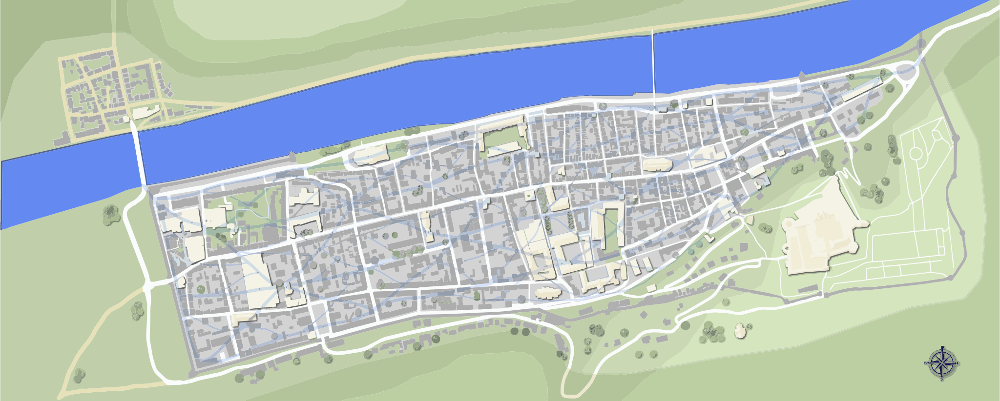

# Session 25: Underneath It All

As the party talks through a watch order, Gavin's frustration built:

> I can't just sit here while my daughter gets carved up.
> I'm going to the Palace of Justice and talk to the Watch.
> I'll bring back a Mage of the Order, and they'll figure out what's going on.

Grabbing the finger, notes, coin, and box, he moved toward the door.
Del interceded, cautioning Gavin to be careful what he says.

> If you bring them back here, they're going to get distracted by the renegades among us.
> That won't help your daughter.

Gavin, anguished, acknowledged the point, but is incapable of seeing any other options.

Edgar walked over with the leather map, and proposes an alternative: the map may lead to a lair in the sewers.
Some could run down that clue, while the others caught up on their sleep.
Fave signals his agreement, advocating they split into two groups.
This mollifies the merchant, who returns to the main area and continues to pace.

The parties formed up: Sorven, Edgar, Fave, Guy, and Yenna donned cloaks.
Arguing about red dots, they head back out into the night.
Arc, Brorvec, and Del retired to their rooms.
Vaelyn, after tucking a concerned Rayna into bed, returned to talk to Gavin.

Yenna suggested they head as far east as they can, and then double back, sweeping for the red dots as they go.
In agreement, the group headed toward Father's Gate and Sunrise Circus.
The rain has abated into a cool mist, making it difficult to see more than a few dozen yards.
Guy and Fave trailed behind, eyes peeled for anyone following, or anything amiss.

{:.art}

<a href="https://www.artstation.com/jdayley">Art by Jessica Dayley</a>

Arriving at the circle, nothing too interesting stood out.
An old, rickety hay cart sat abandoned to one side, waterlogged and barely upright.
The well was a good size, more than a yard in diameter, its rope and winch in good repair.
Walking the perimeter of the road, Edgar counted off four grates for storm drains, each far too small to admit anything larger than a very young child.

## Into the Well

Fave, curious and impatient, grabbed the rope and leapt over the side of the well.
Finding the wet rope more trouble than it was worth, he instead jammed his arms and feet against the walls, sliding down the wet stone.
No one was surprised by any of this, each walking calmly over as they heard the splash.
A guard at the wall, hearing the commotion, peeked his head out and made eye contact with Yenna before ducking back inside.

Edgar, before jumping to follow Fave, dropped a small glass object into Sorven's hands.
Understanding what the younger man wanted, the mage whispered a spell, activating the item.
His vision doubled briefly, before settling into a fish-eye view from his own palms.
The orb gave off a barely-perceptible glow as it floated downward.

Edgar, pulling himself out of the cold river water onto the ledges of the sewer, spent a moment in payer.
His entire body emitted the glow of a constant torch, blinding Fave and the glass eye for a moment.
A hiss from Guy above let them know to cover up a bit, prompting Fave to throw his cloak over Edgar as best he could as they walked.

Edgar and Fave headed east along the tunnel, following the fresh water downstream.
The path curved northward for several dozen yards, passing beyond the city walls above.
It ended in a steep ramp down to a second level of sewers, from which emanated an almost overwhelming stench.
The steady flow of river water pushed a continuous sludge toward the steadily increasing roar of the Blackwater River.
Unnoticed by the duo, the glass eye turned and zipped back to its controller.

Following the ramp, the pair descended to the sewage level.
The smell pressed in at their senses, and wrapping their cloaks around their faces did nothing to quench it.
Retracing their steps above, they arrived at a three-way split with storm drains emptying along the walls.
Fave, succumbing to the stench, vomited into the slow-moving sludge.
That was enough to motivate both men to head back up to the freshwater level with haste.

Tugging the rope, they signaled to the Strig above their readiness to exit.
Yenna pulled up Fave, his weight on the bucket causing it to creak ominously.
A harsh whisper from Sorven urged Edgar to douse his light, though he balked until Guy threatened him.
With an audible scowl, Edgar ceased to glow, and Guy elevated him to the surface, hand over hand.
Edgar's hasty knot failed, but he was close enough to the surface that Yenna was able to grab him.

## The Purloining Edgar

Heading southwest along Mercy Street, the party matched up white dots with the wells as they passed.
The closest red dot seemed to match up to a well outside the City Administration Building, three stories of drab stone with a basic facade and slate roof.
Sorven pointed out the building might be an excellent place to find a map of the sewers.
Edgar loved this idea, and circled the building to find the best way in.
He's not entirely sure, but he explains that the bottom floor is probably entirely offices, even if the upper floors might have some residential apartments.

Settling on the northeast entrance, he puts his back to the houses across the street, and rushes to pick the lock.
A soft click signaling his success, he was invisible within seconds and through the door.

The hallway on the other side was covered in an inexpensive plaster, with tile flooring.
Opening a door on the left, he found a drafting room with tables and inkwells, but no document storage.
The hall ended in a large antechamber, complete with receptionist desk.
A pair of stairwells, heading in opposite directions, were positioned at the end of the hall facing the double-door entryway.

A second pair of locked doors, these farther apart, beckoned Edgar from the other side of the room.
Despite being simpler locks, Edgar found these took longer to pick, his heartbeat thudding in his ears.
He sighed as he opened the door: the back walls of this room, beyond a wide reception counter, were covered in books and nooks for loose documents and scrolls.
The organization system was straightforward enough, and Edgar was able to find the Public Works section quickly enough.

Three copies of the waterways map sat clumped together, one much older than the other two.
Edgar spent several minutes poring over and comparing them, but was unable to find any significant differences.
He took one of the newer ones, rolling it tight and stuffing it into his cloak.

{:.art}

<a href="https://github.com/mlmckaig">Art by Matt McKaig</a>

Finding the accession ledger, a scan through revealed no interesting names or documents checked in or out within the past few weeks.
Making his way back out of the building, Edgar took the time to re-lock each door along his path.

## Beneath Their Feet

Close to midnight, the group headed back to the Skeleton Key.
Laying out the map on a table and comparing it with the strip of leather, they argued about where the red dots matched up.
They identified the Father's Sept, the City Administration Building, and to Gavin's surprise:

> That's the well in our basement!

Confusion ensued as most of the group was taken aback by the idea of a well below them.
Gavin was incredulous:

> How do you think running water works?  Magic?

In the basement, the group looked through the setup: a well of dimensions similar to the others, this one surrounded by the pipes of a horse-drawn pump system, leading up to the cistern on the roof.

Edgar whispered a prayer and began to glow, signaling wordlessly his intent to go in and look around.
Yenna tied him into the bucket rope, showing him how to untie himself when he reached the bottom.
She lowered the man into the dark, feeling the rope go slack after only a few yards.

Edgar's first attempt to untie himself failed, while his second only seemed to cinch the rope tighter across his ribs.
This caused him to panic, flailing against both the knot and the sewer walls.
Several frantic attempts later, he was finally able to extricate himself.

A slow exploration of the freshwater area revealed nothing interesting.
Even with his glow, it was still too dark to do any kind of thorough traffic analysis.
He made his way westward to a junction, but saw nothing amiss.
Heading back, he managed to tie himself back in, get belayed to the basement by Yenna, and untie himself without incident.

Sorven, without a hint of humor, suggested to Gavin that he'd likely wanted to cover the well to prevent further entry.
Gavin agreed, and suggested some magical protections would also be appreciated.
Edgar related the dead end, handing the sewer map to Gavin.
He explained the map's provenance, and Gavin agreed to make two copies of it within a day or two so it could be returned.

## Outcomes

* 2XP for everyone, +1 for Edgar for doing all the hard work

