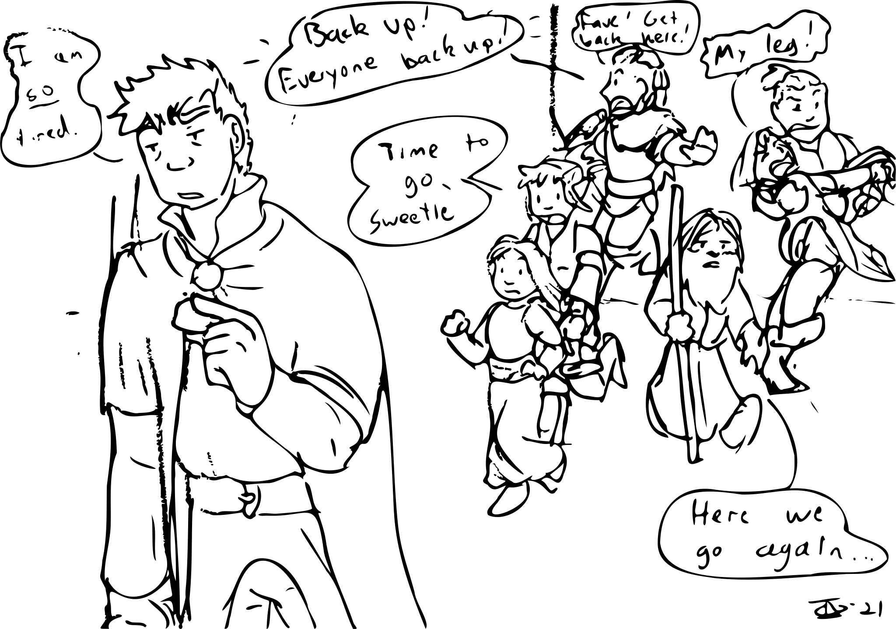

# Session 27: Could you not?

> Be ready to catch him.

Sorven reached out with his staff, nudging the unconscious Fave in the shoulder with his staff.
He followed this with an incantation in a language the Strig didn't know, but had heard before, in the sept.
With a barely-audible sigh, the young monk slid into Yenna's arms, and then to the stone floor, passing through the spear heads which impaled him as if they were immaterial.
Immediately, his wounds began to well with blood.

Yenna used her hands to apply pressure to his neck and torso wounds.
Guy pulled a small oiled-leather-wrapped bundle from his bag, untying it as he handed it to Edgar.
Several flaps fell away, revealing compressed bandages, clotting herbs, and other First Aid items.
The trio circled the young man and went to work.

Sorven, barely pausing to catch his breath, again tapped the monk on the shoulder with his staff.
Vaelyn and Rayna felt the air hum, recognizing the energies of a major healing spell.
The raw energy transfer should have winded the old man, but he merely smiled and nodded.

The four large wounds stitched closed as everyone looked on, bloody Strig hands falling away as their owners realized their efforts were no longer needed.
Fave's eyes snapped open and pushed to his feet in seconds.
Yenna continued to tend to the now smaller wounds, lashing the bandages in place even while the young man fidgeted.

Without a word, she put her palms out in front of her, signalling she'd leave him be, and stepped back.
Looking for something useful to do, she stepped over to the remaining spears of the trap.
Thinking she's have to work to free them, she was surprised to find they came free of their moorings with just a pull.
Collecting an armful of the heavy weapons, she went around the group and offered one to each person, dumping the rest out of the way in the corner.

## The Third Tunnel

The north end of the tunnel went dark as the flame trap sputtered out.
Del came around the corner, leaning heavily on his staff, moving slowly.
Guy ran over, looking for wounds.
He found none, but sucked air through his teeth at the drawn and overexerted visage of the mage.
Del slumped against a wall and closed his eyes, breathing heavily.

Fave, meanwhile, was again growing impatient already, eyeing the hallway to the west, and the dim light coming from its end.
Edgar's whispered prayer before fading from view might have included a drawn-out sigh.
The last thing Vaelyn saw Edgar do was pull free the ornate, enchanted spyglass from his bag.
Those around him heard a hiss as he looked through it and down the hallway.

Edgar watched through the device as he saw the young monk step onto and past a glowing section of the floor.
He didn't have the expertise to know exactly what the swirling yellow and red energies meant, he was willing to bet it was another fire and glue trap.
Another glowing shimmer could be seen at the end of the hallway, this one filling the space of what looked like a doorway, and visible to his naked eye.
Those around him heard a whisper:

> Traps.  Stay left.

A single step later, he nearly collapsed to the floor in pain.
As his heel struck the stone, slow, oozing magical energies crept up his leg.
He'd felt this necromancy before, and didn't need to remove his armor to know his leg was withering away beneath him.
The spell ran its course in moments, leaving the limb barely able to hold his weight.
Yenna, seeing his invisibility drop as he fell to a knee, reached out a large hand and pulled him to her in a single motion.

## The Lady Revealed

The Lady Dunwich stepped into view on the other side of the magical curtain.
Her voice had a muffled, distant quality as she spoke:

> Well come, my pets, let's play some more.

Fave ran at her without hesitation.
Five quick steps and a leap, and he was flying through the air with a heel kick that would have downed a person twice his size.
His foot met the translucent barrier, which resisted with the force of a stone wall.
Caught off guard, he managed to translate his momentum into a roll, ending flat on his back against the wall.
He was on his feet in the blink of an eye, and threw a series of punches at the unreachable lich.

Del, eyes shifting between the undead Lady and his comrades now grouped up around him, got shakily to his feet and stepped out of her line of sight.
Looking straight at Guy, he shook his head: 

> Nope.  Your turn.

The fierce, cursing yell came not from the Strig, but from the gently glowing stone in Sorven's hand.
It continued a stream of profanities, many in languages unknown to anyone for thousands of miles, as the old man's form began to fold and shift.

Yenna looked at her bloody hands, the two exhausted mages, the young child, the disciple gasping in pain, and the impenetrable magic wall.
Scooping Edgar off the floor and over her shoulder, she used the combined size to usher the half-elves back the way they'd come.
She only got a half dozen steps before the hairs on the back of her neck began to sing.
Something in the darkness at the end of the hall, beyond the light of her headband, was _wrong_.
Skidding to a halt, she got out a single word:

> Oh F—

The next yell came from Del, in a Mellinarathi so thickly accented Vaelyn and Rayna could barely make it out.
They spun to face him, only to see him carving the air with his staff.
His face was pale and drawn, his eyes locked on the back of Yenna's head.
Vaelyn didn't recognize the energies, but she got the sense of something against the natural order.

## Ten Minutes Ago

The world around Del exploded in an unbearable cascade of octarine visual noise, before reality itself melted away into inky blackness.
He suppressed a gasp as the energies released from his staff caused it to get hot enough to almost burn his palm.
Struggling to control his breathing, he flattened himself against the wall and listened.

A soft moaning and shuffling came from the darkness to the south.
As slow and quiet as he could manage, he inched his way back along the wall, away from the sound.
Reaching the corner, he pressed himself against the stone, unmoving, until he was sure he was still alone.
He knew the flame trap was just a few steps away, once again armed and ready to alert the Lady to their presence.

As he waited, a flicker of reflected light bobbed into view at the far end of the hall.
Muffled voices made their way to him, in familiar tones and cadences.
Not willing to risk a mis-step, he whispered the now-familiar incantation to float his weight off the ground, mentally kicking himself for not doing it sooner.
Pulling himself along the wall, he reached the rearmed acid trap and inspected the mechanism.

The clay jar holding the acid looked heavy, and was obviously built to be fragile.
He considered trying to levitate it to the ground, but couldn't gather the will for it.
He slumped to the floor, listening to the quiet commotion below him, trying to figure out what to do next.

## Gate, Grate, and Stone

Edgar and Fave approached the heavy iron gate.
The older of the two pulled his lock picks from his pack and went to work, though he found the rusted lock challenging.
Looking up and noticing the impatience on the faces of Fave and Yenna, he rolled his eyes and stepped back, indicating that Yenna should have a try.
A quick thwack from the butt of one of her axes found the lock broken in half on the ground.

Several people started talking at once.
Guy, Vaelyn, and Rayna noticed Del had vanished, and were asking the others if anyone had seen anything.
Yenna, hearing this, pulled out her second axe and stepped back through the tunnel.
Vaelyn asked if he might have gone back to bed, as he had been quite unhappy about being rounded up.
Guy shook his head, looking grave:

> No.  If this is what I think it is, he's done this before.
> We need to stay put and wait for him to come to us.

Sorven, nodding, pointed to the grate in the ceiling and the stone in the water beneath it.

> This is curious, don't you think?

Fave, unconcerned about the missing mage, made toward the now-open gate.
Edgar grabbed him by the shoulder and told him to wait.

Vaelyn gripped the gnarled wood of her staff, and spoke an incantation familiar to Rayna.
Her eyes unfocused, as if listening to a whisper from across an open field.
The mage at the other end of the connection began speaking before she had a chance to structure her thoughts.

> Tell those idiots to stand back from the grate and the stone.
> They're going to trigger every trap in this place.

The mental projection of Del's message wasn't just words — it came dripping with a judgment and hostility she'd not yet heard from the man.
It made her stomach flip to learn she and her daughter were committed to help from someone with so much pent-up anger, even as her rational mind knew every person could be pushed to their limits.
Sending a wordless acknowledgment, she passed along his words to the group, putting out her arms to push everyone back.
His next message instructed her to use her staff to disturb the grate, but to be ready to move back.

Doing so, she heard the crack of something shattering above them, followed by a caustic stench which burned her nose hairs.
A viscous green ooze rained down from above them, pock-marking the stone where it landed.
Del's next message came as the flow began to wane:

> Have one of the Strig slide the grate out of the way, so I can come down and join you.

Yenna did so, helping the mage down from the hole above them.
He looked awful, with red-rimmed eyes as if he'd not slept in days, and the gaunt and hollow cheeks they'd seen when he'd pushed too hard in the sept.

## Del Rejoins the Party

Sliding down to sit against the wall, he spent the next ten minutes retelling everything he knew about the trap-laden tunnel above.
He spent significant time describing the flames peeling away Edgar's flesh, and the four spears protruding from Fave's body, locking eyes with each of the men as he did so.

{:.art}

<a href="https://www.artstation.com/jdayley">Art by Jessica Dayley</a>

Sorven put his hand on the younger man's shoulder to comfort him, and the others could see the color return to his cheeks.
The older man stepped back, fishing inside his robes.
When he pulled his hand free, it had the small eyeball-shaped device they'd all seen before.

> We need more information.  I can use this.

Everyone liked this idea of scouting without the danger.
Sorven concentrated for a moment, causing the eye to rise from his palm.
It floated up into the hallway above, the old wizard speaking as it traversed the tunnels.

> I see her, the Lady.
> She's on the right side of the room, waiting for us.
> Across her is Gerin, chained to a wall.
> There are more traps here — some kinds of mechanical levers.
> We may also have another way in: a sewer grate in the ceiling.

Ideas flew back and forth as the party discussed the best ways to get into the room without setting off every trap along the way.

# Outcomes

* Last week: 3XP, +1 for Yenna
* This week: 2XP, +1 for Fave & Edgar
