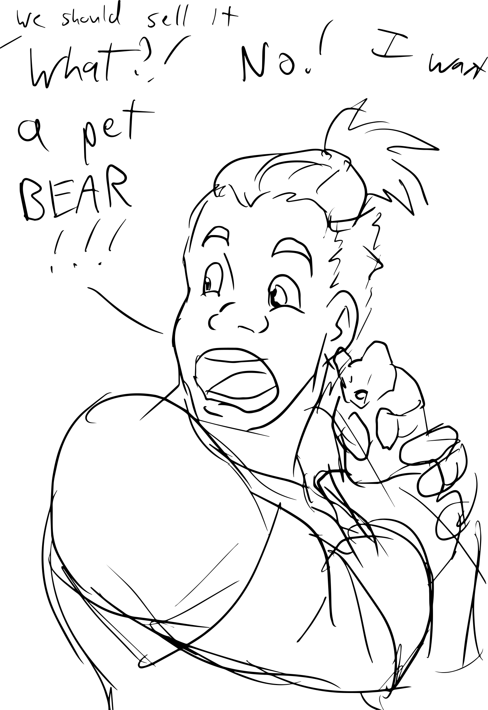

# Session 31: Flynn and Bear It

The night passed without further excitement.
Everyone got a full rest, waking late in the morning of Delmi, the 20th of Flocktime.

Yenna was one of the first up, eager to get her repaired armor back.
Fave accompanied her to Mad Cow Leatherworks, carrying the remaindered mercenary armor in a sack over his shoulder.
One of the workers recognized it as a previous commission of theirs, from years back.
They quoted a fee of $50, and a week's work, to get everything back in a wearable state.
Fave, reluctant to wait that long, offered double if they could do it in two days.
An agreement was struck, and the monk handed over half the coin up front.

Edgar waited more than an hour at the Healing House for Carl, but the man never arrived.
Saddened but unsurprised, he pulled out a list given to him by Sorven.
In a surprisingly elegant hand, the first name at the top of the list was Miaven Zinsalor.
The accompanying address listed her just a few blocks away.

Not sure what to expect, Edgar slipped into an alleyway and went invisible before knocking on the door.
The unkempt elf who answered the door had a temperament to match.
Short, bald, and possibly drunk, the man swayed as he searched through the cracked door for the source of the knocking.

Not seeing an opportunity to get past the man, Edgar again got off the street before returning to visibility.
Knocking once again, he heard crashes and swearing from inside the dwelling.
The elf was belligerent from the start, confronting Edgar about why he was being such a bother.
When asked about Miaven, the elf said he'd never heard the name.
Telling Edgar to piss off, he slammed the door in the young man's face.

## Big Eyes, Small Purse

Returning to the Skeleton Key, Edgar found Yenna and Brorvec talking about enchanting their gear.
Edgar explained that there was only one licensed enchantry in town: Nicodemus' "Falling Star Magic & Mysteries".
He also explained that Nicodemus was one of the people called out in some journal scraps they'd found in the sept of the Maiden, and was not in any way to be trusted.
Tucking the symbol of his faith into his shirt, he led the other two the few blocks south to the shop.

The woman there introduced herself as Cassandra.
She seemed eager to make a sale, but also suspicious of the odd trio before her.
A number of enchanted items were on offer, including a cloak which repelled dirt, was waterproof, and would adjust its size to fit the wearer.
At mention of the price tag, 178 Royals ($25,000), her face fell as she saw it was well out of range of the patrons.

Yenna inquired what it would take to enchant her chakrams to return to her hand when thrown.
Cassandra had her describe the weight and material, going so far as to have Yenna sketch the weapons for her.
She hedged a bit, preferring to see the weapons up close before quoting a final price, but estimated the job would take some 7 months and cost 285 Royals ($40,000) in labor and materials.

Yenna, not entirely put off by this estimate, asked if Cassandra knew an enchantment to help her use the weapons in tight corners.
Maybe something that helped the discs stay accurate after being bounced off stone walls?
Cassandra said she didn't think she'd heard of such an enchantment, but she'd ask around.

Brorvec was especially interested in items with protective enchantments.
He had a lengthy conversation with the woman about rights of elemental protection, anti-magic shields, and more.
A ring of fire protection, for example, would cost around 215 Royals ($30,000) and take four months.
The prices and delays, once again, were beyond him, drawing Cassandra's patience thin.

Almost at the same time, Edgar and Yenna asked whether Cassandra was open for barter, or is cash-only.
The woman said they are always happy to trade, if the items were interesting enough.
Edgar asked if they contract out retrieval of such items.
Raising an eyebrow, the woman said they might be — the group could leave their contact information.

Excited at the opportunity for further adventuring, the three each scribbled out the same thing: contact through Gavin Monkreif, at the Skeleton Key.
Cassandra acknowledged that she knew Gavin well, and worked with him regularly.
Their business concluded, visible disappointment on the merchant's face, the trio made their way out.

Edgar offered up they should drop in on Nelora, but found her shop dark and locked.
They looked around for any sign of when she'd return, to no avail.
Looking at the second name on Sorven's list, he directed the trio to Blue Star Alchemy

The large, older man behind the counter greeted them with a mischievous twinkle in his eye.
Edgar asked if Ophivial was there, or had been around.

> Sure.  Got her right under the counter here.

The man, Thelonius, kept a straight face for only a moment before guffawing at his own joke.
He said he'd never heard of her, and tried to get the trio back on the topic of buying something.

Edgar, once again, asked if the merchant could use any assistance obtaining supplies.
Squinting at them, the man considered the offer.

> Do you do foot massages?
> 'Cause that's what I need most right now.

Edgar looked disappointed, before smiling with an idea.
Muttering a quick prayer, he reached across the counter and gently laid a hand on the large man's shoulder.
The man cocked an eyebrow and slowly pushed the hand away.
Matching his shrug, Edgar mumbled "it was worth a try", thanked the man, and walked out.

## Midtown

Del stepped out of the high sun into the Sore Thumb Tavern.
Most of the lunch crowd was either gone, or broken up into small card games.
Del spotted Flynn at one such table, with a modest pile of copper in front of her.
Flicking her eyes at a table in the corner, he gave a slight nod as he passed on his way to the bar.
Taking several minutes to wrap up her game and collect her winnings, she found him nursing a cider and bowl of what might have been stew.

> You've looked better.

The dark-haired woman looked as she always did to Del: a nebulous age that could have been anything from early 20s to late 50s.
Her skin had the unblemished look of someone who spent very little time in the sun, and gave the countenance of someone far more naive and vulnerable.
Del knew well how that visage was crafted to put people off their guard, and was determined to not fall victim to it.
Ignoring her opening comment, he got straight to business.

> Talk to me about your stock these days.
> Anything interesting come through lately?

A shallow frown shadowed her face before she launched into her pitch.
She described a spear granted the ability to pierce armor as easily as flesh.
Upon seeing Del's lack of interest, her eyes rolled back as she filtered through her mental inventory.
Smirking, she held her hands in front of her, marking off a space in the air maybe six inches tall.

> Oh, I know one you'd like.
> A small figurine of a cave bear, almost like a children's toy.
> Except when you throw it, the bear grows to full size and attacks your enemies.

Del tried to stifle his immediate excitement, thinking of just how often Yenna talked about missing the wolf she'd kept as a pet for years.
She'd never told him how the wolf had died, but he'd gotten the impression it was not pretty.
She would absolutely lose her mind over a bear.
He asked the price.

> 570 Royals ($80,000).

He sucked air through his teeth.
That was almost as much as _everything_ they'd managed pull out of the Sept.
Edgar had been convinced they could get a good price for a few items, but even the most expensive item was only going to fetch maybe 350 Royals.
Thinking of what the others had told him about Nicodemus' shop, he changed tacks.

> If I had a magical item or two, are you in a place where you could move them?
> Say, a dagger with a necromantic enchantment to steal life from its victims.
> What could you get me for that?

Flynn seemed intrigued, but also wary.

> You've seen this item?
> Spent time with it
> Verified the enchantment yourself?

Nodding, what should have been a moment of pride for Del soured and felt like his ability was under question.

> Like you taught me, yes.

Flynn's face went blank as she considered the mage, reassessing what she thought she knew about him.

> We shouldn't talk about this in the city.
> I'm having dinner at the Cock & Balls tonight.
> Meet me there.

Not waiting for his answer, she got up from the table and walked out the door.

## Skeleton Key

Mid-afternoon at the Skeleton Key, everyone was waiting for Del to return.
Gavin called for everyone to join him in the main room, drawing everyone close around the central table.
Looking at each mage in turn, he asked:

> I have a serious matter to discuss with you all.
> Can any of you tell if we're being spied upon?

Vaelyn nodded, getting up from the table and pulling out a piece of practitioner's chalk.
Del also got up, offering to help — he didn't know the spell, but knew enough to see the fundamentals of what she was working on.
The duo took their time to ceremonially cast a pair of spells.

The first told Vaelyn, to the limits of her abilities, that no one was attempting to observe them from afar.
For the second, she had the group pull in tight, drawing an even smaller circle and set of sigils around them.
The spell took another minute of chanting from the two, ending with a deadening of the surrounding air.
Their voices seemed to evaporate into nothingness as they spoke, Vaelyn explaining that the spell should prevent eavesdroppers for ask long as she maintained it.

Gavin got right to the point:

> I need your help with opening the Tome of Asturias.

Edgar hissed at him, immediately demanding to know who wanted it open.
Gavin pointedly ignored the question, continuing:

> The book hasn't been opened in 700 years.
> If apocryphal accounts are to be believed, it contains a map of all things magic: ley lines, areas of aspected mana, locations of naturally-occurring powerstones, and more.

One by one, the group exhaled.
Each knew that such a book would be incredibly valuable to any number of dangerous people.

Gavin explained the four-way power struggle for control of the book and its secrets: the Castle, the Council, the Order, and the Church.
Each wanted the book for their own purposes.
Worse, the lines between those groups were muddy and always in flux, as the power players like Nicodemus pitted the groups against each other from within.

Vaelyn, voice strong and clear even against the suffocating spell, demanded to know what else Gavin wasn't telling.
The man didn't seem phased by this, stating only that to understand the full scope of the machinations would take more than a single conversation, as it would be tantamount to giving a history of Blackwater itself.
The half-elf didn't seem mollified by this, but dropped her prosecution.

Edgar says he's familiar with the background of the Tome, and offers to fill in some gaps:

> Opening the Tome requires you take it to the Temple of Syrinx.
> Finding the temple requires the Ley Rods of Vellinor.
> They show the way to the island, and might help get past "the umbra", some kind of permanent mist enchantment which hides the island from the world.
> Oh, and there might be a dragon.

Gavin looks impressed at the young man, and says that aligns with his information.

> The rods went down in a shipwreck some years ago — the _Cantwell_.
> I've been asked to put together the expedition to retrieve the rods, find the temple, and return with a map to its location, as well as an account of anything else one would need to know to get there.
> For that, I need you.
> The offer is 100 Royals ($14,000) per person.

Edgar wondered aloud if the Sea Elf Queen of Shalimar might be a place to start.
Gavin shakes his head, explaining that sea elves are very xenophobic and hostile to any intruders on their domain.

As the questions trailed off, Gavin got the hint that the party wanted to talk through it on their own.
He took his leave, and the party headed up to the second floor.
Del, unexpectedly eager to get everyone's attention, began:

> As usual, I don't think he's telling us everything.
> I might have another option.
> I have a contact, Flynn, the renegade mage who taught me, who may know more about the politics and plays happening here.

Edgar was nonplussed at the idea of bringing in an outsider.
As Del expressed how little he trusted his contact, Edgar grew more agitated.
The two worked out a dialogue for Del to get as much as he could, without giving too much away.
They also agreed to see if Flynn could move the dagger, as that would be less likely to draw attention than Cassandra and Nicodemus.

Fave, also unusually eager to communicate, worked through Edgar to explain his own part in this.
He'd recently been granted a vision from the Mother.
He believed she'd shown him the way to open the Tome in a way that would allow the Mother to permanently seal it, so that its knowledge could never fall into the wrong hands.

Brorvec and Vaelyn were more optimistic about Flynn's involvement.
They hoped if Flynn could bring in more renegade mages, that might destabilize the situation, providing opportunities.
As people expressed doubt about Del's ability to keep the group's agenda hidden, Vaelyn offered an option: she had a way to give Del the ability to hide his emotions for an hour, hopefully throwing off the insight of anyone probing him for details.

Cobbling together a workable plan, the group split up.
Excepting Del, Brorvec, and Arc, the rest of the group would head over to Ferton and get some dinner, available to keep an eye on Del.
Del would give Edgar the dagger to smuggle out of the city, and then follow behind.
One everyone agreed, spells were cast, loot was arranged, and everyone got moving.

## The Cock & Balls

The sun was low on the horizon as the group arrived at the tavern.
The large establishment was mostly empty, with only a few of the several dozen tables occupied.
Going for maximum visibility, they found a large round table in the middle of the room.

A man was over within moments to attend them.
He offered up slow-roasted pork, twice-baked onions, and other mouth-watering options.
When debate broke out about which to order, he eyed the Strig and said he'd just bring a selection of everything.

> Providing, of course, you can show the color of your coin.

Everyone around the table jingled the purses on their belts without hesitation.
The man seemed satisfied, and began trips back and forth from the kitchen, bringing heaping plates and bowls.
The food wouldn't win any awards with royalty, but it was aromatic and better than you'd see on most days.

Fave walked over to stand at the bar, keeping an eye on the party and the room.

Del walked in some ten minutes later.
He spotted Flynn in a table against the back wall, her shoulder at the rear door.
Not acknowledging the party, he walked straight to her and sat down.

While making pleasantries, Del dropped a hand below the table, wiggling his fingers in a beckoning motion.
Moments later he felt the weight of the dagger drop into his hand, a small click as the loose sheath slid against the blade.
As if fumbling to get it out of his robes, he brought it to the table, concealing it beneath his sleeve.
He passed it across to table to her, where she mirrored his concealment and gave the artifact a once-over.

> Interesting.
> Indeed, that does seem to be necromancy.
> I'd have to spend time with it to be sure.

Not missing a beat, Del responded:

> Good.
> I wanted to spend some time with that bear statue.

Bemused, she shook her head and explained she didn't have it with her.
She offered that they could meet up in a few days and appraise the items together.
She knew a place near the Sept of the Stranger where they'd have some privacy.
Del agreed, familiar with the location, taking back the dagger and dropping it into a pocket.

> I have more serious business, where we might be able to help each other.
> I've recently been offered a job on an expedition to uncover a way of getting into a certain tome.
> The knowledge inside this particular book would be of great interest to people like you and I.
> But I also know it's of interest to a number of groups in Blackwater working against us.

Flynn's eyes narrowed, but Del couldn't get a read on what that meant.

> I'm tracking a number of magical tomes.
> To which one are you referring?

This response brought Del up short.
As the person who had introduced Del to magic, Flynn _always_ seemed to have the upper hand in every conversation.
Yet, he now had the distinct impression that she didn't have any idea what he was talking about.
It was disconcerting.

> If you don't already know, it's better if I don't say anything more.
> Things are already messy enough, and this is likely more attention than you'd want.

She didn't seem happy with the answer, but seemed content to let it drop.
Standing up from the table, she fished out a coin and flipped it onto the table.

> Dinner's on me.
> See you in two days.
> And tell your Strig friends it was nice to meet them.

The untouched plates before him were tantalizing after the past few very long days.
Without glancing back at the other table, he pulled the food close and dug in.

A few minutes later, he noticed bits of stewed apple began to disappear from his plate.
Listening closely, he was able to make out a faint chewing sound from the empty seat across from him.
Try as he might, however, he could not make out the smell of eucalyptus over the strong scents coming off their meal.

{:.art.max-width-half}

<a href="https://www.artstation.com/jdayley">Art by Jessica Dayley</a>

# Outcomes

* Fave put down $50 (half of the total $100) to get his armor repaired at Mad Cow.  Done by the 22nd.
* Everyone gets 1XP, plus an additional 1XP for Fave.
* Everyone can add Gavin as a Contact (18pt):
  * Effective skill 18
  * Almost always available (15)
  * Usually Reliable
  * Business/Merchant, Research, Ancient History, Literature, Languages
